## K-Means

​		例如：

```python
import numpy as np
from scipy.cluster.vq import vq,kmeans,whiten
list1=[88.0,74.0,96.0,85.0]
list2=[90.0,99.0,95.0,94.0]
list3=[78.0,84.0,90.0,98.0]
list4=[97.0,94.0,91.0,64.0]
list5=[68.0,74.0,90.0,100.0]
list6=[80.0,80.0,100.0,100.0]
data=np.array([list1,list2,list3,list4,list5,list6])
whiten=whiten(data)#算出各列元素的标准差
centroids,_=kmeans(whiten,2)#对数据进行聚类，分成2类
result,_=vq(whiten,centroids)#vq矢量量化数据，对每个人进行聚类
print(result)
```

​		输出结果：

```
[1 1 1 0 1 1]
```


## Matplotlib绘图

​		主要用于二维绘图；

​		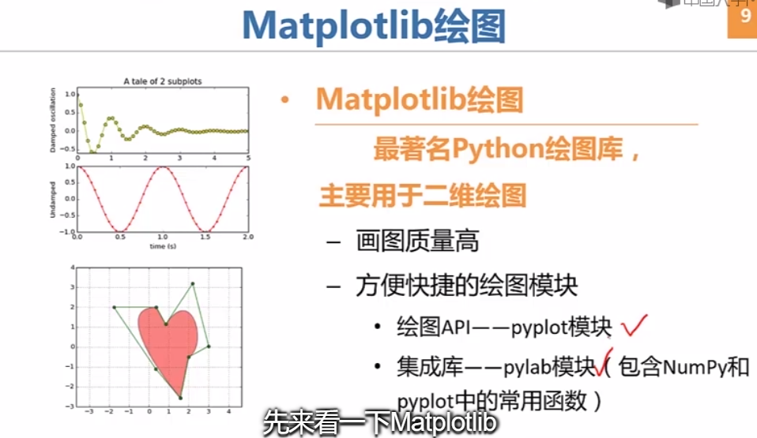

​		

​		

#### 	绘图属性

​	颜色和样式：

​	

​	其他属性：

​	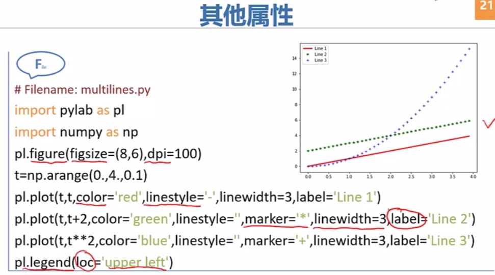

​	多子图显示：

​	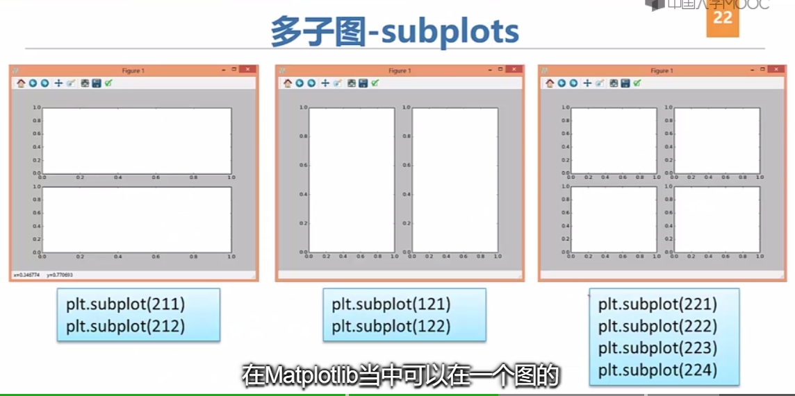

```
import pandas as pd
import matplotlib.pyplot as plt
import pylab as pl
plt.rcParams['font.sans-serif']=['SimHei']
plt.rcParams['axes.unicode_minus']=False
qutoesdf=pd.read_csv(r'C:\Users\ligang\Desktop\2.csv')
#print(qutoesdf)
qutoesdf1=qutoesdf.iloc[:100,:1]
# print(qutoesdf1)
cols=['temp0',]
qutoesdf1.columns=cols
#print(qutoesdf1)
qutoesdf1.index=range(1,len(qutoesdf1)+1)
print(qutoesdf1)

qutoesdf2=qutoesdf.iloc[:100,1:2]
# print(qutoesdf1)
cols=['temp1']
qutoesdf2.columns=cols
#print(qutoesdf1)
qutoesdf2.index=range(1,len(qutoesdf2)+1)
print(qutoesdf2)

x=qutoesdf1.index
y=qutoesdf1.values
plt.subplot(211)
plt.title('冷端温度曲线')
plt.xlabel('时间/min')
plt.ylabel('温度/℃')
plt.plot(x,y,color='r',marker='o')

x=qutoesdf2.index
y=qutoesdf2.values
plt.subplot(212)
plt.title('冷端温度曲线')
plt.xlabel('时间/min')
plt.ylabel('温度/℃')
plt.plot(x,y,color='g',marker='o')

plt.show()
# print(qutoesdf1)
# x=qutoesdf1.index
# y=qutoesdf1.values
#
# plt.title('冷端温度曲线')
# plt.xlabel('时间/min')
# plt.ylabel('温度/℃')
# plt.plot(x,y,'g--')
# plt.show()
# pl.plot(x,y)
# pl.show()
```

​		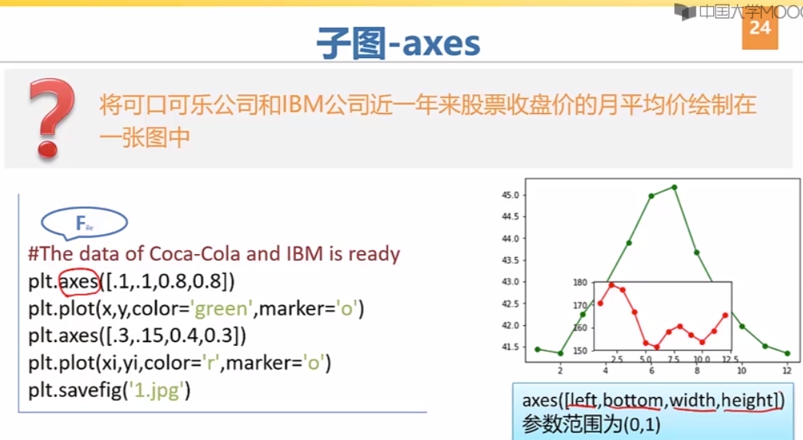

------------------------


------------------

#### pandas作图

​		pandas通过整合Matplotlib的相关功能，可以实现基于Series和DataFrame的某些绘图功能，针对这两种类型的数据，pandas作图常常比pylab和pyplot作图方便。

​		在使用pandas进行绘图时，我们可以联合pylab和pyplot绘制。

```python
import pandas as pd

```

​		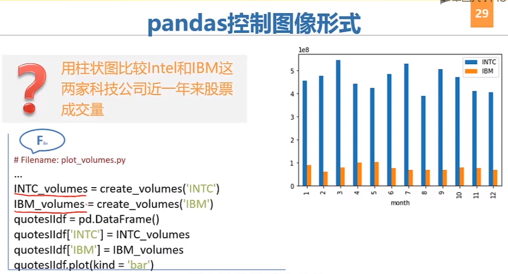

​		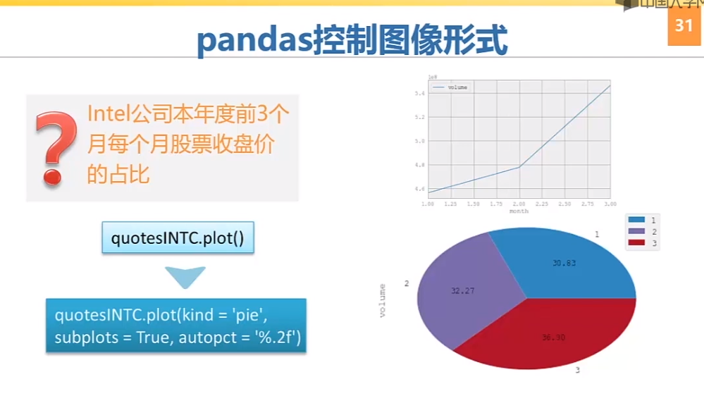

​		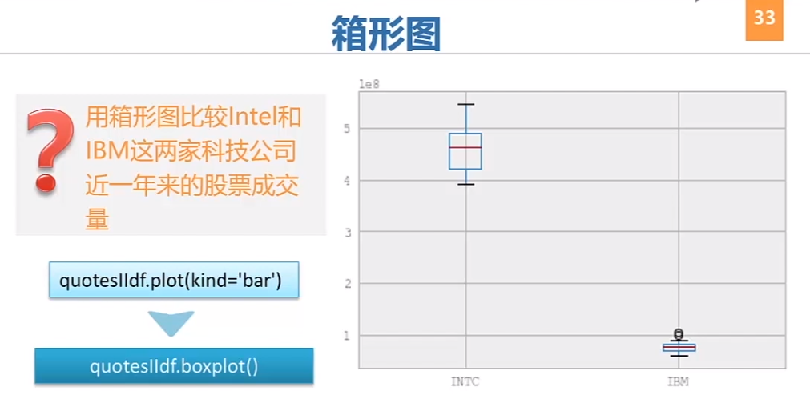


------------

#### 数据存取

​		

​		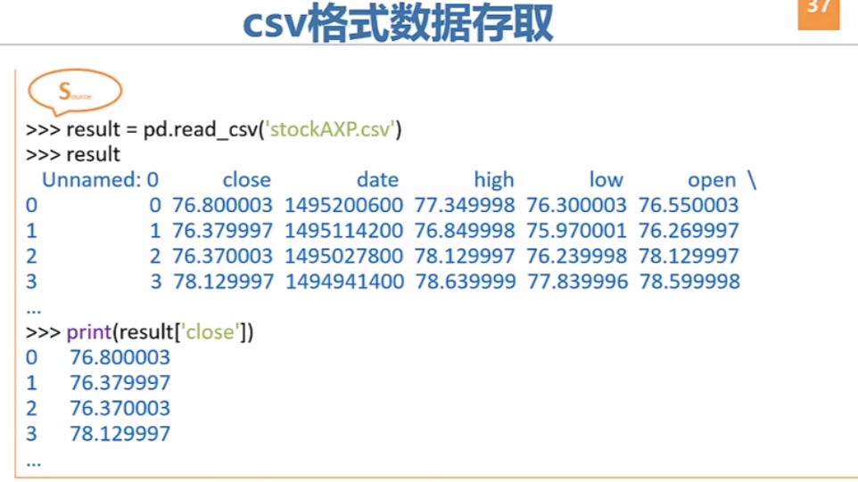


------------------

#### Python应用

​		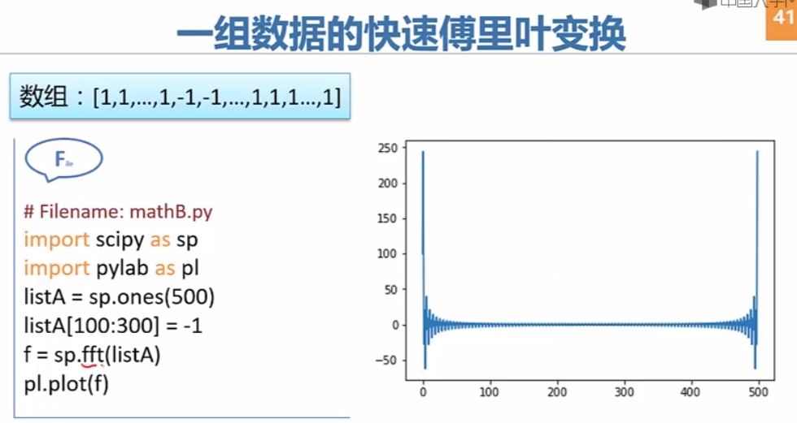

​		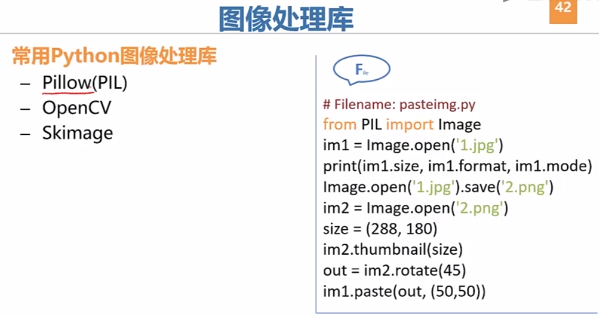

​		

```
from PIL import Image
im1=Image.open(r'C:\Users\ligang\Pictures\Saved Pictures\iphonex\1.jpg')
print(im1.size,im1.format,im1.mode)
Image.open(r'C:\Users\ligang\Pictures\Saved Pictures\iphonex\1.jpg').save('2.png')
im2=Image.open('2.png')
size=(384,216)
im2.thumbnail(size)
out=im2.rotate(45)
im1.paste(out,(50,50))
im1.show()
```

​		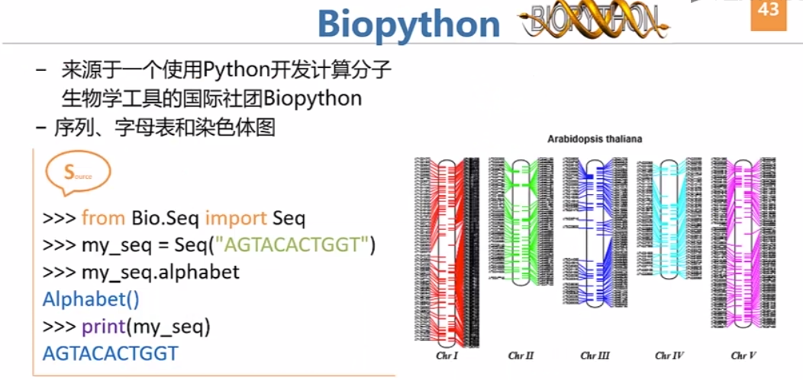


------------------

#### NLTK

​		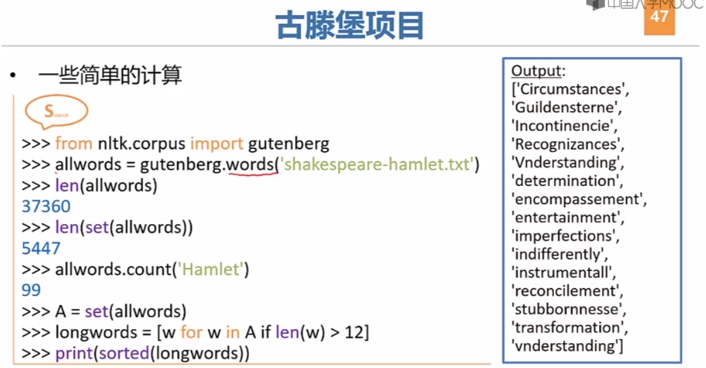

​		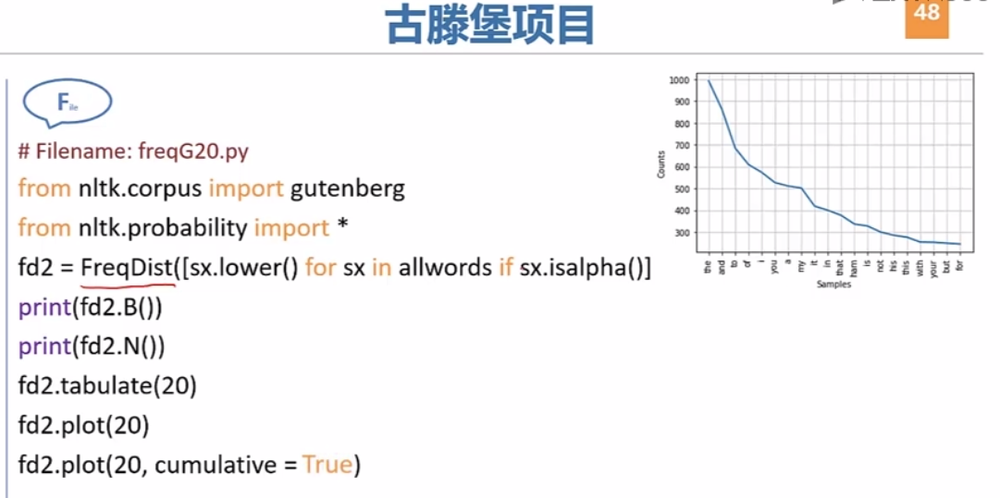

​		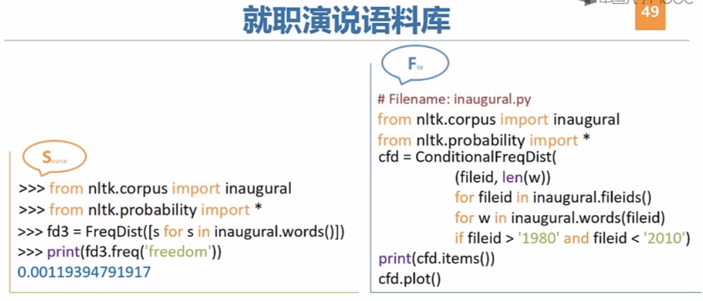


------------------

#### 类

​		

​		

​		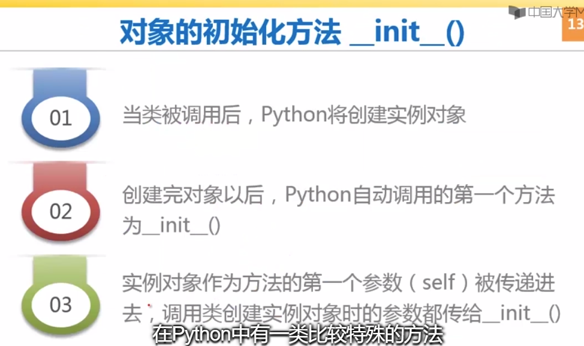

​		

​		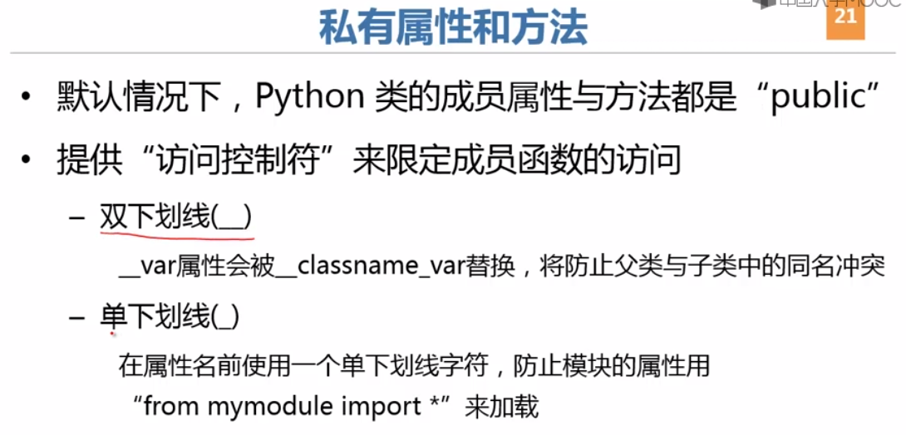

​		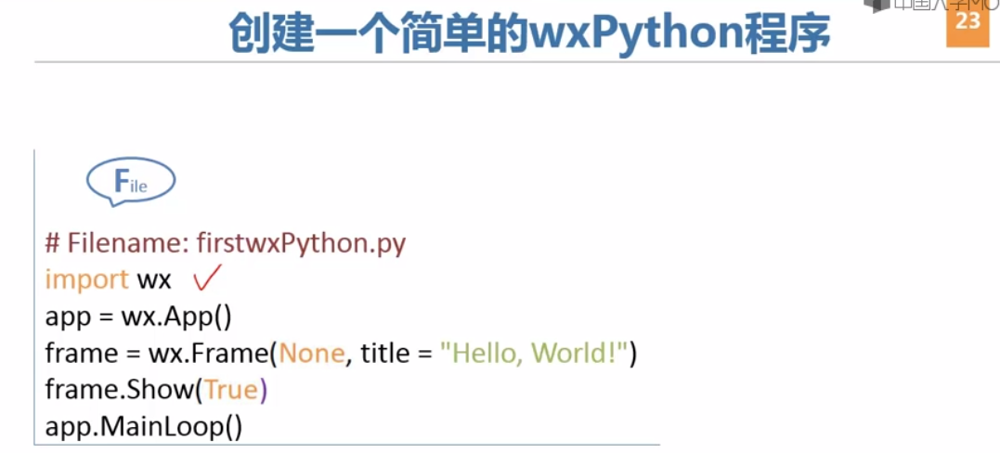

​		

​		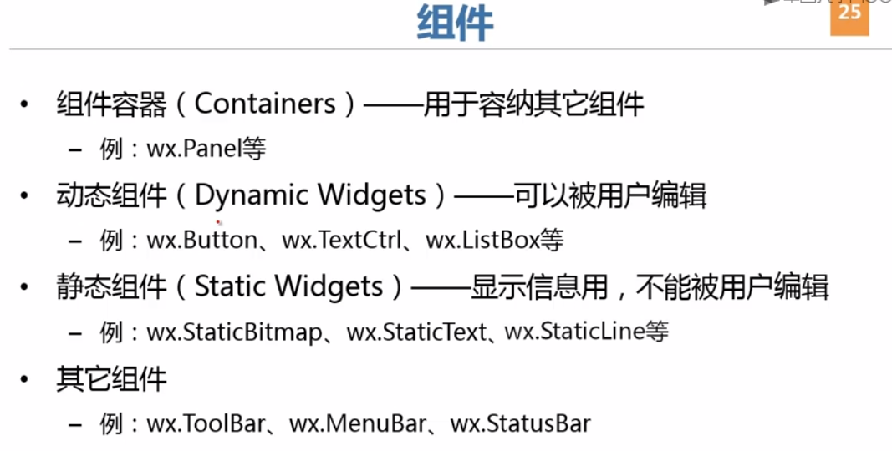

​		

​		

​		

