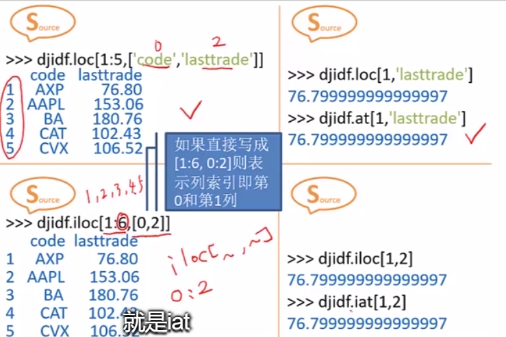

## 用Python获取数据

#### 1 网络数据如何获取

​		抓取：

​				urllib内建模块：urllib.request

​				Requests第三方库

​				Scrapy框架

​		解析：

​				BeautifulSoup库

​				re模块


------------

#### 2  Request库

​			<https://2.python-requests.org//zh_CN/latest/index.html>

​			r=request.get(‘URL’)进行抓取

​			r.status_code查看状态，返回200则为正常；

​			r.text返回抓取的内容。


------

#### 3  网页数据解析

​			BeautifulSoup是一个可以从HTML或XML文件中提取数据的Python库。

​			re正则表达式模块进行各类正则表达式处理。

​			

​			爬取《复联4》影评：

```python
import requests
from bs4 import BeautifulSoup
r=requests.get('https://movie.douban.com/subject/26100958/comments?status=P')
soup=BeautifulSoup(r.text,'lxml')
pattern=soup.find_all('span','short') #属性
for item in pattern:
    print(item.string)
```

​		


------------------

#### 4  迷你爬虫编程练习

​		**要求：抽取某书的前50条短评内容并计算评分（star）的平均值**

```python
#抽取某书的前50条短评内容并计算评分（star）的平均值
import requests,re,time
from bs4 import BeautifulSoup

count=0
i=0
s,count_s,count_del=0,0,0
lst_stars=[]
while count<50:
    try:
        r=requests.get('https://book.douban.com/subject/26163454/comments/hot')#请求地址
    except Exception as err:
        print(err)
        break

    soup=BeautifulSoup(r.text,'lxml')
    comments=soup.find_all('span','short')#爬取的条目属性
    pattern=re.compile('<span class="user-stars allstar(.*?)rating"')#正则表达式

    p=re.findall(pattern,r.text)
    for item in comments:
        count +=1
        if count>50:
            count_del+=1
        else:
            print(count,item.string)#打印爬取内容
    for star in p:
        lst_stars.append(int(star))
    time.sleep(5)   #delay requests from douban's robots.txt
    i+=1
    for star in lst_stars[:-count_del]:
        s+=int(star)
if count>=50:
    print(s//(len(lst_stars)-count_del))
```

​		输出结果：示例取的是豆瓣中《数学之美（第二版）》的书评；

```python
1 书名取的有点大，应该叫做《互联网体现的数学之美》。读者最好有一定的数学基础，尤其是高等数学，不然恐怕体会不了太多的美。
2 看到一坨概率论和数理统计的瞬间，我的内心是崩溃的。
读到后面数学公式少了很多。
有人说推荐给中学生看，我只能说，太看得起中学生了。
3 写的很不错。不过本书的问题在于，如果事先不懂得线性代数，随机过程，还有基本的算法数据结构以及计算机基础知识，那很难被科普到，如果事先懂了这些知识，才会觉得写的浅显易懂，如果是这种情况，那又没有读的必要了。不过科普书籍都有这类问题。
4 总体不错，但正准确一些的书名应该是《数学及其在IT行业的应用之美》～
5 增加了大数据等内容。
6 我以后有了孩子会让他读吴军的全套书
7 本书深入浅出，内容涵盖较广，但书名起的有点大了。本书涉及的数学（大学数学课程）主要包括概率论，统计学，马尔科夫链，图论，信息论，神经网络等，相对而言，以上仅是数学里的一小部分分支。除此之外，结合作者在 Google 的经历，用浅显易懂的语言解释了以上数学分支在文本挖掘（自然语言分析，分词，语义分析），网络爬虫，密码学，搜索引擎等工作原理，可为这些方面的入门之作，值得一读。
8 感慨一句，学习工科好久，从事工程也不短，到头来，对数学还害怕、畏惧不懂上了。
9 学习分为道和术，我一直花了很多时间点满自己的各种技能树，但内心还是一直迷茫。遇到这本书之后，才发现自己迷茫的原因。我忙于学习各种术，却疏于修炼道。
10 第一版也读过, 中学的时候能读到就好了
11 高中或者刚刚上大学的时候，最好看看这本书，科普启蒙
12 这种博客文章的形式决定了对每个话题的介绍都只能浅尝辄止，内容丰富全面，阅读感也很好，就是标题实在有欺诈的嫌疑。
13 得到听的。讲了数学的简单之美和严谨之美。作者希望大家不但能体会到数学之美还能创造出数学之美且从中受益。
14 将很多高大上的东西，比如语言分析、搜索引擎排名、地图导航、云计算、神经网络等概念，非常浅显易懂的说明了出来，隐藏在这些前沿科技的背后，往往只是一两个非常简单的数学公式，对，就是我们学过的那些：线性代数、贝叶斯公式、切比雪夫不等式等等。一位优秀的科学家能写出优秀的论文引领科技，而一位优秀的科普作家能将非常晦涩的概念深入浅出的表达出来，吴军博士就是这样子做的。
15 通过《大学之路》了解到吴军博士，十分羡慕他的家庭能给子女带来择校前的实地访游机会。不过我当时没有对《数学之美》和《浪潮之巅》产生兴趣，因为他的书籍名称都取得太大，使人没有办法直接通过标题来判断其内容。本书主要介绍Google采用的一些技术，尤其在搜索引擎领域，可见当时自然语言处理就已在业界大显身手，并非AI火爆促使NLP的崛起。比起PHY那些架在空中的知识，我认为业界的技术越来越得我心，因为它能直接被使用，因为它能直接带来价值，给人以便捷，给开发者以收益。
16 中国的数学教育，弊病在于：学生在学习时不知道所学何用，在学完甚至可以熟练解题后依然不知所学何用。这本书，在能读懂的基础上，越早让学生接触越好。
17 比之前kindle上看的要完整
18 过年期间，抽空看完，对一些算法，数学模型，数据的用途有一些初步了解。开始有点明白那些做算法的朋友都在干些什么了。下一本看《浪潮之巅》，之后再回头好好了解里面的推导细节。
19 写作技巧厉害，我居然都看懂了
20 科普并不深，口气像老外
21 书名取的有点大，应该叫做《互联网体现的数学之美》。读者最好有一定的数学基础，尤其是高等数学，不然恐怕体会不了太多的美。
22 看到一坨概率论和数理统计的瞬间，我的内心是崩溃的。
读到后面数学公式少了很多。
有人说推荐给中学生看，我只能说，太看得起中学生了。
23 写的很不错。不过本书的问题在于，如果事先不懂得线性代数，随机过程，还有基本的算法数据结构以及计算机基础知识，那很难被科普到，如果事先懂了这些知识，才会觉得写的浅显易懂，如果是这种情况，那又没有读的必要了。不过科普书籍都有这类问题。
24 总体不错，但正准确一些的书名应该是《数学及其在IT行业的应用之美》～
25 增加了大数据等内容。
26 我以后有了孩子会让他读吴军的全套书
27 本书深入浅出，内容涵盖较广，但书名起的有点大了。本书涉及的数学（大学数学课程）主要包括概率论，统计学，马尔科夫链，图论，信息论，神经网络等，相对而言，以上仅是数学里的一小部分分支。除此之外，结合作者在 Google 的经历，用浅显易懂的语言解释了以上数学分支在文本挖掘（自然语言分析，分词，语义分析），网络爬虫，密码学，搜索引擎等工作原理，可为这些方面的入门之作，值得一读。
28 感慨一句，学习工科好久，从事工程也不短，到头来，对数学还害怕、畏惧不懂上了。
29 学习分为道和术，我一直花了很多时间点满自己的各种技能树，但内心还是一直迷茫。遇到这本书之后，才发现自己迷茫的原因。我忙于学习各种术，却疏于修炼道。
30 第一版也读过, 中学的时候能读到就好了
31 高中或者刚刚上大学的时候，最好看看这本书，科普启蒙
32 这种博客文章的形式决定了对每个话题的介绍都只能浅尝辄止，内容丰富全面，阅读感也很好，就是标题实在有欺诈的嫌疑。
33 得到听的。讲了数学的简单之美和严谨之美。作者希望大家不但能体会到数学之美还能创造出数学之美且从中受益。
34 将很多高大上的东西，比如语言分析、搜索引擎排名、地图导航、云计算、神经网络等概念，非常浅显易懂的说明了出来，隐藏在这些前沿科技的背后，往往只是一两个非常简单的数学公式，对，就是我们学过的那些：线性代数、贝叶斯公式、切比雪夫不等式等等。一位优秀的科学家能写出优秀的论文引领科技，而一位优秀的科普作家能将非常晦涩的概念深入浅出的表达出来，吴军博士就是这样子做的。
35 通过《大学之路》了解到吴军博士，十分羡慕他的家庭能给子女带来择校前的实地访游机会。不过我当时没有对《数学之美》和《浪潮之巅》产生兴趣，因为他的书籍名称都取得太大，使人没有办法直接通过标题来判断其内容。本书主要介绍Google采用的一些技术，尤其在搜索引擎领域，可见当时自然语言处理就已在业界大显身手，并非AI火爆促使NLP的崛起。比起PHY那些架在空中的知识，我认为业界的技术越来越得我心，因为它能直接被使用，因为它能直接带来价值，给人以便捷，给开发者以收益。
36 中国的数学教育，弊病在于：学生在学习时不知道所学何用，在学完甚至可以熟练解题后依然不知所学何用。这本书，在能读懂的基础上，越早让学生接触越好。
37 比之前kindle上看的要完整
38 过年期间，抽空看完，对一些算法，数学模型，数据的用途有一些初步了解。开始有点明白那些做算法的朋友都在干些什么了。下一本看《浪潮之巅》，之后再回头好好了解里面的推导细节。
39 写作技巧厉害，我居然都看懂了
40 科普并不深，口气像老外
41 书名取的有点大，应该叫做《互联网体现的数学之美》。读者最好有一定的数学基础，尤其是高等数学，不然恐怕体会不了太多的美。
42 看到一坨概率论和数理统计的瞬间，我的内心是崩溃的。
读到后面数学公式少了很多。
有人说推荐给中学生看，我只能说，太看得起中学生了。
43 写的很不错。不过本书的问题在于，如果事先不懂得线性代数，随机过程，还有基本的算法数据结构以及计算机基础知识，那很难被科普到，如果事先懂了这些知识，才会觉得写的浅显易懂，如果是这种情况，那又没有读的必要了。不过科普书籍都有这类问题。
44 总体不错，但正准确一些的书名应该是《数学及其在IT行业的应用之美》～
45 增加了大数据等内容。
46 我以后有了孩子会让他读吴军的全套书
47 本书深入浅出，内容涵盖较广，但书名起的有点大了。本书涉及的数学（大学数学课程）主要包括概率论，统计学，马尔科夫链，图论，信息论，神经网络等，相对而言，以上仅是数学里的一小部分分支。除此之外，结合作者在 Google 的经历，用浅显易懂的语言解释了以上数学分支在文本挖掘（自然语言分析，分词，语义分析），网络爬虫，密码学，搜索引擎等工作原理，可为这些方面的入门之作，值得一读。
48 感慨一句，学习工科好久，从事工程也不短，到头来，对数学还害怕、畏惧不懂上了。
49 学习分为道和术，我一直花了很多时间点满自己的各种技能树，但内心还是一直迷茫。遇到这本书之后，才发现自己迷茫的原因。我忙于学习各种术，却疏于修炼道。
50 第一版也读过, 中学的时候能读到就好了
44
```


------------

#### 5  数据显示

​		显示方式：

   - 显示行索引dataframe.index

   - 显示列索引dataframe.columns

   - 显示数据的值dataframe.values

   - 显示数据描述dataframe.describe

     ​	

     显示方式：

     - 显示行
       - 专用方式.head(5)	.tail(5)	.shape	.size
       - 切片

     - 显示列


------------------

#### 6  数据选择

​		选择方式：

  - 选择行

    - 切片
    - 索引

  - 选择列

      - 列名[‘code’]	.code

        ​	

  - 选择区域

      - 行、列

          - 标签label（loc）

            ​	

        - 单个值 at

          ​	

    - 行、列和区域

      - 用iloc（位置）

      - 取某个值 iat

        ​	

  - 筛选（条件选择）

    ​	


