# Task1

## 1、Python环境搭建

#### （1）资源池

​	**python安装包（建议）**：Anaconda（支持多种操作系统，集成了主流的科学计算包）

​	下载链接：

​	官网： <https://www.continuum.io/downloads>

​	清华大学镜像：<https://mirrors.tuna.tsinghua.edu.cn/anaconda/archive/>


​	**python IDE（建议）：**PyCharm （由 JetBrains 打造的一款 Python IDE，支持 macOS、 Windows、 Linux 系统）

​	下载链接：

​	官网：<https://www.jetbrains.com/pycharm/download/#section=windows>


 	**python参考教程和网站：**

- Python编程从入门到实践，Eric Mathes著，人民邮电出版社

- SciPy科学计算生态圈：<https://www.scipy.org/>

- Wes McKinney, Python for Data Analysis. 东南大学出版社（英文影印本，中译版名为《利用Python进行数据分析》）

- 廖雪峰python学习笔记：https://blog.csdn.net/datawhale/article/category/7779959

- python入门笔记

  作者李金，这个是jupyter notebook文件，把python的主要语法演示了一次，值得推荐。下载链接: 

  https://pan.baidu.com/s/1IPZI5rygbIh5R5OuTHajzA 提取码: 2bzh

- 南京大学python视频教程

  这个教程非常值得推荐，python主要语法和常用的库基本涵盖了。

  查看地址：

  https://www.icourse163.org/course/0809NJU004-1001571005?from=study

  

  **安装教程：**

- Anaconda+Jupyter notebook+PyCharm：https://zhuanlan.zhihu.com/p/59027692

- Python入门：Anaconda和PyCharm的安装和配置：<https://www.cnblogs.com/yuxuefeng/articles/9235431.html>

  

#### （2）解释器

​	**1）编译器和解释器的联系**

​	相同点：

- 两者都是高级语言与机器之间的翻译官。
- 都是将代码翻译成可以执行的二进制机器码，只不过在运行原理和翻译过程有不同而已。

​	不同点:

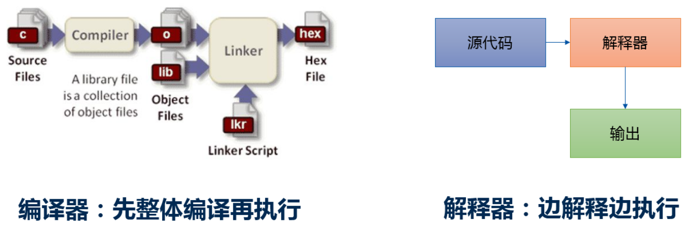

​	用一个通俗的例子进行比喻：我们去饭馆吃饭，点了八菜一汤。编译器的方式就是厨师把所有的菜给你全做好了，一起给你端上来，至于你在哪吃，怎么吃，随便。解释器的方式就是厨师做好一个菜给你上一个菜，你就吃这个菜，而且必须在饭店里吃。

​	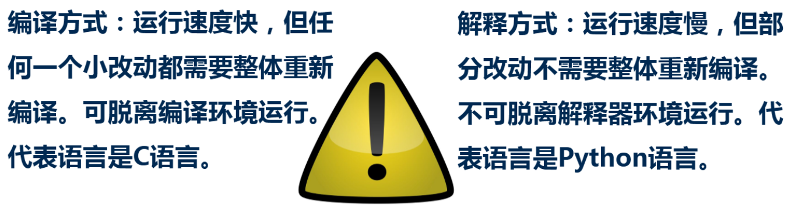

​	**2）Python解释器种类**

​	Python有好几种版本的解释器：

- **CPython**：官方版本的解释器。这个解释器是用C语言开发的，所以叫CPython。CPython是使用最广的Python解释器。我们通常说的、下载的、讨论的、使用的都是这个解释器。

- **Ipython**：基于CPython之上的一个交互式解释器，在交互方式上有所增强，执行Python代码的功能和CPython是完全一样的。CPython用>>>作为提示符，而IPython用In [序号]:作为提示符。

- **PyPy**：一个追求执行速度的Python解释器。采用JIT技术，对Python代码进行动态编译（注意，不是解释），可以显著提高Python代码的执行速度。绝大部分CPython代码都可以在PyPy下运行，但还是有一些不同的，这就导致相同的Python代码在两种解释器下执行可能会有不同的结果。

- **Jython**：运行在Java平台上的Python解释器，可以直接把Python代码编译成Java字节码执行。

- **IronPython**：和Jython类似，只不过IronPython是运行在微软.Net平台上的Python解释器，可以直接把Python代码编译成.Net的字节码。

  【参考资料】：

  a. 编译器与解释器：<http://www.liujiangblog.com/course/python/9>

  b. 编译器与解释器的异同：<https://blog.csdn.net/zp357252539/article/details/78660131>


#### （3）python运行方式

​	1）Shell方式

​		shell是交互式的解释器，输入一行命令，解释器就解释运行相应结果；

​	2）文件方式

​		在Python的IDE环境中，创建一个以py为扩展名的文件，用Python解释器在Shell中运行结果；

​	

## 2 、Python语法

#### （1）输入和输出：print&input函数

​	**print函数：**

​		— print（变量）

​		— print （字符串）

​		print函数可以接受多个字符串，用逗号“，”隔开，就可以连成一串输出。

​		print默认输出是换行的，如果要实现不换行需要在变量末尾加上逗号==，或end=“ ”==


​	**input函数：**返回的类型是字符型；同时，输入是可以带提示语的。

​		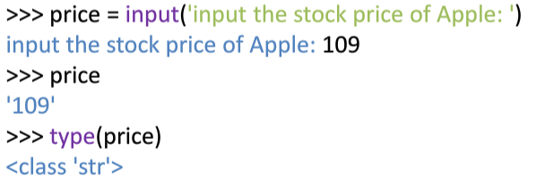

​		***Note：***_如果要求输出的是int、float等类型，需要通过int（）、float（）等函数转换。如下图所示：_

​		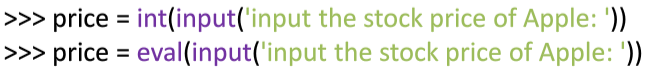

​		_eval（）函数用来执行一个字符串表达式，并返回表达式的值，其语法：_

```
	eval(expression[, globals[, locals]])
```


#### （2）Python风格

​	注释：“#”；

​		python中多行注释使用三个单引号（‘’‘）或者三分双引号（“”“）。

​	续行：“\"；

​		无需换行符可直接换行的两种情况：

​		a. 小括号、中括号、花括号的内部可以多行书写；

​		b. 三引号包括下的字符串也可以跨行书写。

​	一行多语句：”；“

​	缩进：相同的缩进表示同级别的语句块和范围；

​		==缩进的空白数量是可变的，但是所有代码块语句必须包含相同的缩进空白数量。==

​		==**IndentationError: unindent does not match any outer indentation level**错误表明，你使用的缩进方式不一致，有的是 tab 键缩进，有的是空格缩进，改为一致即可。==


#### （3）语法基础

​	**1）变量**

​		变量名：和C语言的命名规则类似；

​	**2）标识符**

​		标识符是指Python语言中允许作为变量名或其他对象名称的有效符号；由字母、数字、下划线组成。

​		**区分大小写**。以下划线开头的标识符是有特殊意义的。

​		==以单下划线开头 **_foo** 的代表不能直接访问的类属性，需通过类提供的接口进行访问，不能用 **from xxx import \*** 而导入。==

​		==以双下划线开头的 **__foo** 代表类的私有成员，以双下划线开头和结尾的 **__foo__** 代表 Python 里特殊方法专用的标识，如 **__init__()** 代表类的构造函数。==

​	**3）赋值**

​	变量第一次赋值，同时获得类型和“值”

​		—python是动态的强类型语言；

​		—不需要显式生命，根据“值”确定类型；

​		—以“引用”的方式实现赋值。

​	增量赋值：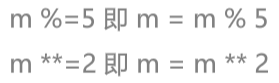

​	链式赋值：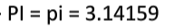

​	多重赋值：等号左右两边都以元组的方式出现；

​			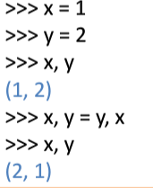

​			**元组打包，序列解包**

​	**4）引号**

​	python可以使用引号、双引号、三引号来表示字符串，引号的开始与结束必须是相同的类型。

​	**5）语句**

​	每一行除注释外都是一个语句，当语句以冒号**“：”**结尾时，缩进的语句视为代码块。

​	**6）dir（）和help（）**

​	dir（）函数一个排好的字符串列表，内容是一个模块里定义过的名字；

​	返回的列表容纳了在一个模块里定义的所有模块、变量和函数。

​	help（）函数可以打印输出一个函数的文档字符串，查看内置函数的参数列表和规范的文档。

​	按下：q两个按键退出说明文档


​	**7）import使用**

​	在python用import或者from…import来导入相应的模块。

​	关于 import 的小结，以 time 模块为例：

​	1、将整个模块导入，例如：**import time**，在引用时格式为：**time.sleep(1)**。

​	2、将整个模块中全部函数导入，例如：**from time import \***，在引用时格式为：**sleep(1)**。

​	3、将模块中特定函数导入，例如：**from time import sleep**，在引用时格式为：**sleep(1)**。

​	4、将模块换个别名，例如：**import time as abc**，在引用时格式为：**abc.sleep(1)**。

​	**8）pep8介绍**

​	pep8是python的编码规范。<https://pep8.org/>

​	代码编排	

​	文档编排

​	空格的使用

​	注释

​	文档描述

​	命名规范


#### （4）Python基础语法图

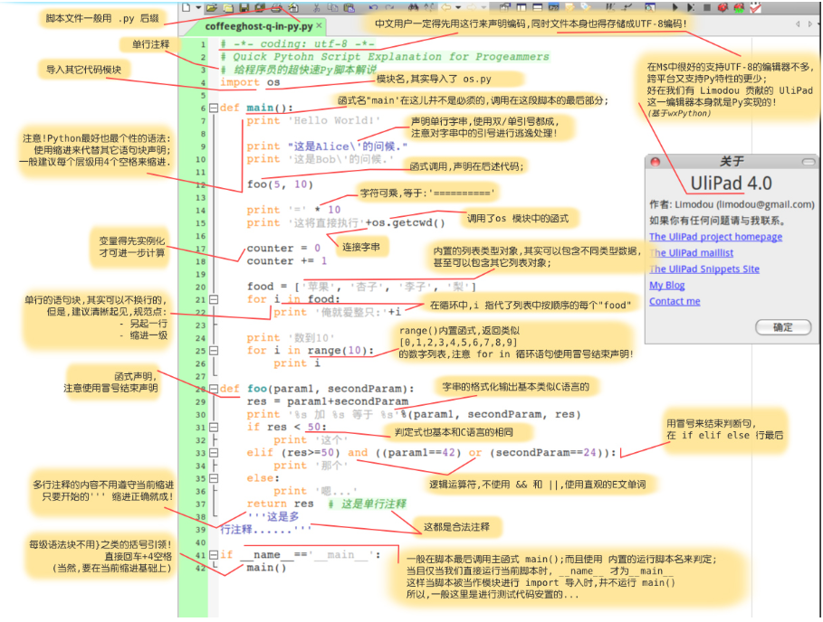


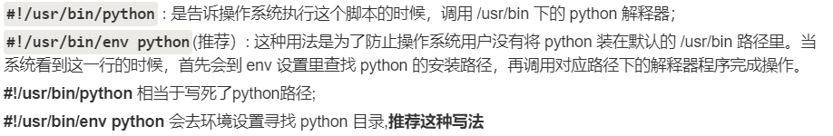


## 3、Python变量类型

​	python中标准数据类型：**数字、字符串、列表、元组、集合、字典**。

​					**可变数据（3个）**：列表、字典、集合；

​					**不可变数据（3个）：**数字、字符串、元组。

#### （1）Python数字

​		**整型：**整型和长整型不严格区分；

​		**布尔型：**整形子类，仅有2个值：True、Flase；

​		**浮点型：**类似科学技术法表示，如9.8e3=9800.0 ；

​		**复数型：**虚数部分必须有j ；

​				复数可以分离实数部分和虚数部分：复数.real     复数.imag；

​				复数的共轭：复数.conjugate；

​		内置的**type（）函数**可以用来查询变量所指的对象类型；还可以使用**isinstance**来判断，如：isinstance(a,int)。

​				type（）不会认为子类是一种父类类型；

​				isinstance（）会认为子类是一种父类类型。

​		_**Note：**_

​				1) 一个变量可以通过赋值指向不同类型的对象；

​				2) 数值的除法包含两个运算符：/返回一个浮点数，//返回一个整数；

​				3) 在混合计算时，会将整型转换成浮点数。


#### （2）序列类型

​		**字符串：**单引号、双引号、三引号都是字符串，==不可变类型==；

​				1. 如果字符串内部既包含 ‘ 又包含 “ 时，可以使用转义字符标识，如下图所示：

​				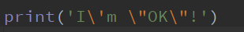

​				输出结果：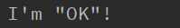

​				2. ==python的字串列表有2种取值顺序:==

​					从左到右索引默认0开始的，最大范围是字符串长度少1

​					从右到左索引默认-1开始的，最大范围是字符串开头

​					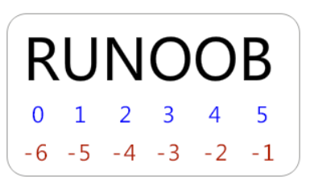

​					==获取字符串[头下标：尾下标]，子字符串中包含头下标的字符，但不包含尾下标的字符。==

​					加号（+）是字符串连接运算符，星号（*）是重复操作。

```
#!/usr/bin/python
# -*- coding: UTF-8 -*-
 
str = 'Hello World!'
 
print str           # 输出完整字符串
print str[0]        # 输出字符串中的第一个字符
print str[2:5]      # 输出字符串中第三个至第六个之间的字符串
print str[2:]       # 输出从第三个字符开始的字符串
print str * 2       # 输出字符串两次
print str + "TEST"  # 输出连接的字符串
```

​					3. Python中字符串不能改变；

​					4. Python没有单独的字符类型，一个字符就是长度为1的字符串。


​		**列表：**强大的类型，用方括号[]界别，==可变类型==；

​		**元组：**用小括号（）界别，==不可变类型==。


#### （3）映射类型   字典

​		用大括号{}界别，类似于哈希表的键值对；


#### （4）空值

​		空值是python中一个特殊的值，用None表示，不能理解为0，因为0是有意义的，而None是一个特殊的空值。


## 4、Python运算符

#### （1）算术运算符

​	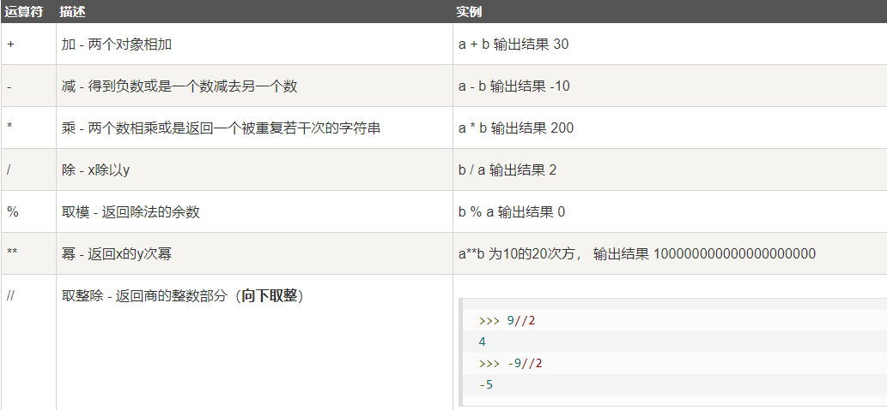

​	==%运算可用于负数==


#### （2）比较运算符

​	数值的比较：按值比大小；

​	字符串的比较：按ASCII码值大小；

​	在python中允许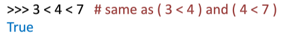


#### （3）逻辑运算符

​	优先级：not 、and 、or


#### （4）字符运算符

​	原始字符串操作符（r/R）：用于一些不希望转义字符起作用的地方；

​	所有的字符串都是Unicode字符串。

​	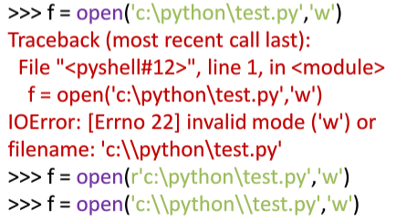

​	如上图所示，如果不想在输入路径时输入两个“\”，就需要在前面添加==r==。


#### （5）成员运算符

​	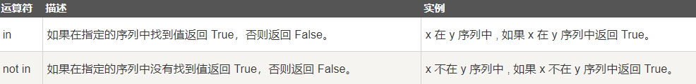

```
#!/usr/bin/python
# -*- coding: UTF-8 -*-
 
a = 10
b = 20
list = [1, 2, 3, 4, 5 ];
 
if ( a in list ):
   print "1 - 变量 a 在给定的列表中 list 中"
else:
   print "1 - 变量 a 不在给定的列表中 list 中"
 
if ( b not in list ):
   print "2 - 变量 b 不在给定的列表中 list 中"
else:
   print "2 - 变量 b 在给定的列表中 list 中"
 
# 修改变量 a 的值
a = 2
if ( a in list ):
   print "3 - 变量 a 在给定的列表中 list 中"
else:
   print "3 - 变量 a 不在给定的列表中 list 中"

```


#### （6）身份运算符

​	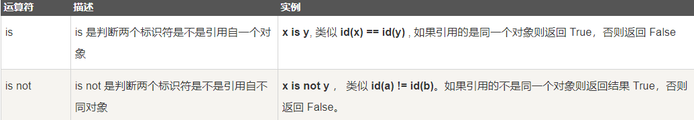

​	id（）函数用于获取对象内存地址。

```
#!/usr/bin/python
# -*- coding: UTF-8 -*-
 
a = 20
b = 20
 
if ( a is b ):
   print "1 - a 和 b 有相同的标识"
else:
   print "1 - a 和 b 没有相同的标识"
 
if ( a is not b ):
   print "2 - a 和 b 没有相同的标识"
else:
   print "2 - a 和 b 有相同的标识"
 
# 修改变量 b 的值
b = 30
if ( a is b ):
   print "3 - a 和 b 有相同的标识"
else:
   print "3 - a 和 b 没有相同的标识"
 
if ( a is not b ):
   print "4 - a 和 b 没有相同的标识"
else:
   print "4 - a 和 b 有相同的标识"
```


#### （7）运算符优先级

​	自上而下，优先级逐步提高。

​	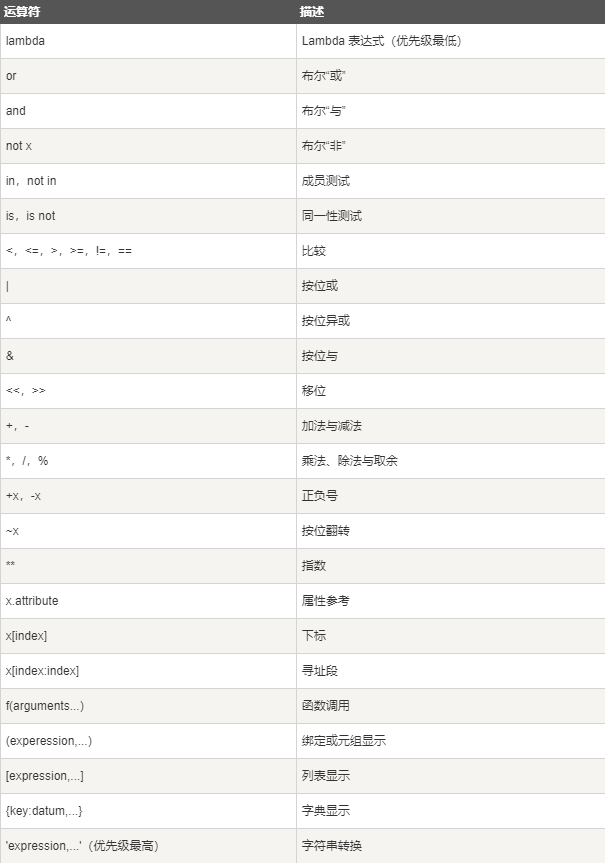


## 5、Python的函数、模块和包

​	**内建函数：**str（）和type（）等适用于所有标准类型；

​	**非内建函数：**通过from *  import  * 引入；（模块）

​	**模块：**一个完整的Python文件即是一个模块；

​			python中通常用“import 模块”的方式将现成模块中的函数、类等重用到其他代码块中。

​			导入多个模块，用逗号分隔开。

​	**包：**一个有层次的文件目录结构；

​		定义了一个由模块和子包组成的Python应用程序执行环境。

​	**库：**是一组具有相关功能的模块的集合。


&emsp; 
