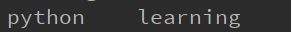

#### Task2**（2day）**

## 1 String（字符串）

#### 1.1  基本操作

​		Python中的字符串中用 ==’== 或 ==“== 。

​		**字符串连接符：**+ 

​		**字符串复制：***  （后面紧跟的数字为复制的次数）

​		例如：

​		字符串str = ‘Runooob’；

​		

​		输出结果：

​		

​	

------------------------------------------------------------------------------------------------------------------------------------------------------------------------

#### 1.2  读取方式

​		**读取方式：**字符串的使用语法与数组类似，采用下标的方式。

```
变量[头下标:尾下标]
```

​		索引值**正向**以**0**为开始值，**反向**以**-1**为开始值。

​		


------------------------------------------------------------------------------------------------------------------------------------------------------------

#### 1.3  反斜杠

​		**反斜杠“ ==\\== ”**

   * 转义特殊字符；

   * 续行符，表示下一行是上一行的延续。

     例如：

     输出结果：

     **也可以使用==“”“…“”“==或者==‘’‘…’‘’==跨越多行。**

     例如：

     输出结果：


------------------------------------------------------------------------------------------------------------------------------------------------------------------------------------------

​		==**注意：**==

​			1、Python没有单独的字符类型，一个字符就是长度为1的字符串；

​			2、与C字符串不同的是，Python字符出不能被改变。向一个索引位置赋值，比如test[0]=‘m’会导致错误；

​			

------------------------

#### 1.4  格式输出

​		

​		常用格式说明符：

​		

​		


------------

#### 1.5  字符串常用方法

​		

​		示例：

​		

​		join方法：连接列表中连个字符串；前面是连接符——空格；

​		

​		编解码：

​		


## 2 List（列表）

​	序列是Python中最基本的数据结构。序列都可以进行的操作包括==**索引、切片、乘、检查成员**==。

​	Python有6个序列的内置类型，最常见的是列表和元组。列表是Python中使用最频繁的数据类型。

#### 2.1  标识符

​	列表可以完成大多数集合类的数据结构实现。列表中元素的类型可以不同，可以**是数字、字符串，以及列表**（所谓嵌套）。

​	列表写在**方括号[]之间、用逗号间隔**的元素列表。

​	列表也可以索引和截取，列表被截取后返回一个包含所需元素的新列表。

​	列表截取语法格式：

```
变量[头下标:尾下标]
```

​	索引值**正向**以**0**为开始值，**反向**以**-1**为开始值。

​	**注意：**

​	截取时，尾下标是不包括在所截的列表中。

​	

-----------------------------------------------------------------------------

#### 2.2  基本操作

​	**列表连接运算符：+**

​	**列表重复操作：\***

​	例如：

​	

​	输出结果：

​	


​	**更新列表**

​	可以对列表的数据项进行修改或更新，也可以使用append（）方法来添加列表项。

​	append（）方法用于在列尾添加新对象，append（）是浅拷贝。

```
list.append(obj)
```

​	例如：

​	

​	输出结果：


​	

​	**删除列表元素**

​	使用del语句来删除列表的元素。例如：

​	

​	输出结果：

​	

​	

------------------------------------------------------------------------------------------------------------------------------------------------

​	==**注意：**==

​		1、**与字符串不一样的是，列表中的元素是可以改变的。**

​		例如：

​		

​		输出结果：

​		

​		2、Python列表截取可以接收第三个参数，参数作用是截取的步长。


-------------------------------------------------------------------------------------------------

#### 2.3  Python列表脚本操作符

| Python表达式                          | 结果                         | 描述                 |
| ------------------------------------- | ---------------------------- | -------------------- |
| len([1, 2, 3])                        | 3                            | 长度                 |
| [1, 2, 3] + [4, 5, 6]                 | [1, 2, 3, 4, 5, 6]           | 组合                 |
| ['Hi!'] * 4                           | ['Hi!', 'Hi!', 'Hi!', 'Hi!'] | 重复                 |
| 3 in [1, 2, 3]                        | True                         | 元素是否存在于列表中 |
| for x in [1, 2, 3]: print(x, end=" ") | 1 2 3                        | 迭代                 |


------------------------------------------------------------------------------------------------------------------------------------------------

#### 2.4  Python列表拼接工作

```
squares = [1, 4, 9, 16, 25]
squares += [36, 49, 64, 81, 100]
```

​		输出结果：

```
squares=[1, 4, 9, 16, 25, 36, 49, 64, 81, 100]
```


------------------------------------------------------------------------------------------------------------------------

#### 2.5  嵌套列表

​		使用嵌套列表，即在列表里创建其它列表。例如：

```
a = ['a', 'b', 'c']
n = [1, 2, 3]
x = [a, n]
>>> x
[['a', 'b', 'c'], [1, 2, 3]]
>>> x[0]
['a', 'b', 'c']
>>> x[0][1]
'b'
```

​		嵌套列表的索引和二位数组操作类似。


------------------------------------------------------------------------------------------------------------------------------------------------------------

#### 2.6  实例

​		**如果第三个参数为负数表示逆向读取；**

​		实例：翻转字符串

```
def reverseWords(input): 
      
    # 通过空格将字符串分隔符，把各个单词分隔为列表
    inputWords = input.split(" ") 
  
    # 翻转字符串
    # 假设列表 list = [1,2,3,4],  
    # list[0]=1, list[1]=2 ，而 -1 表示最后一个元素 list[-1]=4 ( 与 list[3]=4 一样) 
    # inputWords[-1::-1] 有三个参数
    # 第一个参数 -1 表示最后一个元素
    # 第二个参数为空，表示移动到列表末尾
    # 第三个参数为步长，-1 表示逆向
    inputWords=inputWords[-1::-1] 
  
    # 重新组合字符串
    output = ' '.join(inputWords) 
      
    return output 
  
if __name__ == "__main__": 
    input = 'I like runoob'
    rw = reverseWords(input) 
    print(rw)
```

​		输出结果：

```
runoob like I
```


------------------------------------------------------------------------------------------------------------

#### 2.7  Python列表函数和方法

​		Python列表函数：

| 序号 | 函数                                                         |
| ---- | ------------------------------------------------------------ |
| 1    | [len(list)](https://www.runoob.com/python3/python3-att-list-len.html)<br/>列表元素个数 |
| 2    | [max(list)](https://www.runoob.com/python3/python3-att-list-max.html)<br/>返回列表元素最大值 |
| 3    | [min(list)](https://www.runoob.com/python3/python3-att-list-min.html)<br/>返回列表元素最小值 |
| 4    | [list(seq)](https://www.runoob.com/python3/python3-att-list-list.html)<br/>将元组转换为列表 |

​		Python列表方法：

| 序号 | 方法                                                         |
| ---- | ------------------------------------------------------------ |
| 1    | [list.append(obj)](https://www.runoob.com/python3/python3-att-list-append.html) 在列表末尾添加新的对象 |
| 2    | [list.count(obj)](https://www.runoob.com/python3/python3-att-list-count.html) 统计某个元素在列表中出现的次数 |
| 3    | [list.extend(seq)](https://www.runoob.com/python3/python3-att-list-extend.html) 在列表末尾一次性追加另一个序列中的多个值（用新列表扩展原来的列表） |
| 4    | [list.index(obj)](https://www.runoob.com/python3/python3-att-list-index.html) 从列表中找出某个值第一个匹配项的索引位置 |
| 5    | [list.insert(index, obj)](https://www.runoob.com/python3/python3-att-list-insert.html) 将对象插入列表 |
| 6    | list.pop(\[index=-1])(https://www.runoob.com/python3/python3-att-list-pop.html)移除列表中的一个元素（默认最后一个元素），并且返回该元素的值 |
| 7    | [list.remove(obj)](https://www.runoob.com/python3/python3-att-list-remove.html) 移除列表中某个值的第一个匹配项 |
| 8    | [list.reverse()](https://www.runoob.com/python3/python3-att-list-reverse.html) 反向列表中元素 |
| 9    | [list.sort( key=None, reverse=False)](https://www.runoob.com/python3/python3-att-list-sort.html) 对原列表进行排序 |
| 10   | [list.clear()](https://www.runoob.com/python3/python3-att-list-clear.html) 清空列表 |
| 11   | [list.copy()](https://www.runoob.com/python3/python3-att-list-copy.html) 复制列表 |

​		

​		**常用实现方法：**

​		**1、pop()函数**

​		用于移除列表中的一个元素（默认最后一个元素），并且返回该元素的值。

​		语法：

```
list.pop([index=-1])
```

​		【index】 -- 可选参数，要移除列表元素的索引值，不能超过列表总长度，默认为 index=-1，删除最后一个列表值。

​		**2、copy()函数**

​		copy()函数用于复制列表，

​		语法：

```
list.copy()
```

```
list1 = ['Google', 'Runoob', 'Taobao', 'Baidu']
list2 = list1.copy()
print ("list2 列表: ", list2)
```

​		输出结果：

```
list2 列表:  ['Google', 'Runoob', 'Taobao', 'Baidu']
```


​		**3、例如：对评委打分进行处理，去掉最高和最低份，排序等。**

```
jScores=[9,9,8.5,10,7,6,5,8,9,10,8.3]	#评委打分
aScore=9	#观众打分
jScores.sort()	#对打分进行排序
print(jScores)	#注意：此时的jScores是已经排好序的
```

​		或者，使用sorted（）函数对列表进行排序，，但是这种方法不会改变列表本身的顺序，需要将其赋值给另外一个变量

```
jScores=[9,9,8.5,10,7,6,5,8,9,10,8.3]
aScore=9
x=sorted(jScores)
print(x)
print(jScores)
```

​		输出结果：

​		

​		去掉最高和最低分，添加观众打分：

```
jScores.pop()
print(jScores)
jScores.pop(0)
print(jScores)
jScores.append(aScore)		#添加观众评分
print(jScores)
```

​		注意：上面是只有一个元素，使用append函数可以，但是当添加多个元素时，使用extend函数。

​		添加多个元素使用append函，输出结果：

​		

​		添加多个元素使用extend函数，输出结果：

​		

​		

​		**4、参数的作用**

​		通过参数实现逆序排列：

```
jScores.sort(reverse=True)	#参数设置
print(jScores)
```

​		另外，还可以使字符串按长度排列：

​		

​		注意：这里key是python中已经定义好的。


------------------

#### 2.8  列表解析

​		动态创建列表，简单灵活有用

​		


## 3  Tuple（元组）

​		元组写在小括号 **()** 里，元素之间用逗号隔开。元组中的元素类型也可以不相同。

​		虽然元组的元素不可改变，但它可以包含可变的对象，比如list列表。

​		构造包含0个或1个元素的元组比较特殊，所以有一些额外的语法规则：

```
tup1 = ()    # 空元组
tup2 = (20,) # 一个元素，需要在元素后添加逗号，否则括号会被当作运算符使用
```

#### 3.1  访问元组

​		元组与列表和字符串类似，使用下标索引访问元组中的值。


------------------------------------------------------------------------------------------------------------------

#### 3.2  修改元组

​		元组中的元素值是不允许修改的，但可以对元组进行连接组合（”+“）。


------------------------------------------------------------------------------------------------

#### 3.3  删除元组

​		元组中的元素值是不允许删除的，但可以使用del语句来删除整个元组。

​		输出变量会有异常信息：

​		


------------------------------------------------------------------------------------

#### 3.4  元组内置函数

​		**Python元组包含内置函数：**

| 序号 | 方法及描述                        | 实例                                                         |
| ---- | --------------------------------- | ------------------------------------------------------------ |
| 1    | len(tuple) 计算元组元素个数。     | `>>> tuple1 = ('Google', 'Runoob', 'Taobao') >>> len(tuple1) 3 >>> ` |
| 2    | max(tuple) 返回元组中元素最大值。 | `>>> tuple2 = ('5', '4', '8') >>> max(tuple2) '8' >>> `      |
| 3    | min(tuple) 返回元组中元素最小值。 | `>>> tuple2 = ('5', '4', '8') >>> min(tuple2) '4' >>> `      |
| 4    | tuple(seq) 将列表转换为元组。     | `>>> list1= ['Google', 'Taobao', 'Runoob', 'Baidu'] >>> tuple1=tuple(list1) >>> tuple1 ('Google', 'Taobao', 'Runoob', 'Baidu')` |


------------------

#### 3.5  元组的作用

​		元组用在什么地方？

- 在映射类型中当作键使用

- 函数的特殊类型参数

- 作为函数的特殊返回值

  ​	

  **可变长位置参数（元组）**

  

  *星号*，好像有收集参数的功能。*


​		**元组作为函数的特殊返回值**

​		

​		


