#### Task3**（2day）**

## 1 Dict（字典）

#### 1.1  定义

​		字典是另一种可变容器模型，且可存储**任意类型对象**。

​		字典的每个键值（key=>value）对用冒号（:）分割，每个对之间用逗号（,）分割；整个字典包括在花括号（{}）中，即：

```
d = {key1 : value1, key2 : value2 }
```

​		**键**必须是唯一的，但**值**则不必；另外注意，字典的键值是**“只读”**的，所以不能对键和值**分别进行初始化**。

​		值可以取任何数据类型，但键必须是不可变的，如字符串、数字或元组。

​		字典支持无限嵌套，如：

​		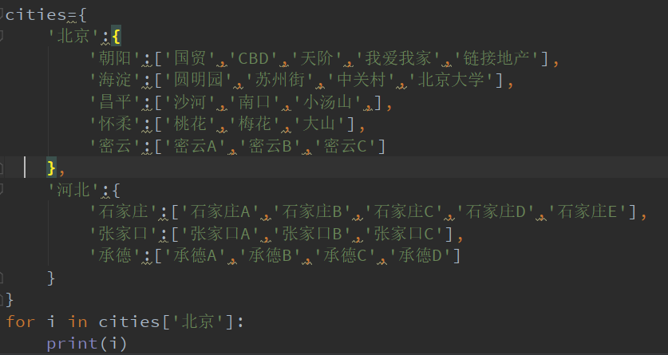

​		输出结果：

​		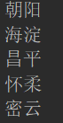

​		查看嵌套的字典值：

​		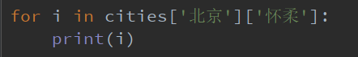

​		输出结果：

​		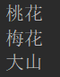


------------------------------------------------------------------------------------------------------------------------------

#### 1.2  访问字典里的值

​		把相应的键放入到**方括号**中，例如：

​		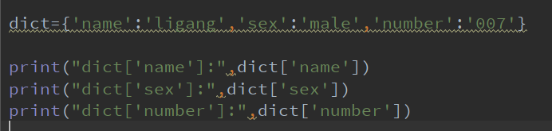

​		输出结果：

​		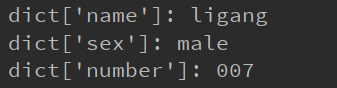

​		**注意：**访问字典里没有的键数据，如访问 ’ list ‘ 键，会出现如下错误：

​		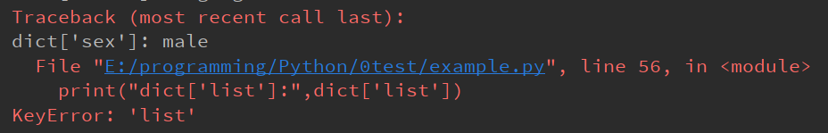

​		

------------------------------------------------------------------------------------------------------------------------------------------------------------------

#### 1.3  修改字典

​		**对键/值对进行增、删、改、查。**

​		**修改操作**：

```
dict = {'Name': 'Runoob', 'Age': 7, 'Class': 'First'}

dict['Age'] = 8;               # 更新 Age
dict['School'] = "菜鸟教程"     # 添加信息
```

​		

​		**删除操作**：

​		删除单一元素：del命令；

​		清空字典：.clear()；

​		删除字典：del + 字典名；

```
dict = {'Name': 'Runoob', 'Age': 7, 'Class': 'First'}
 
del dict['Name'] # 删除键 'Name'
dict.clear()     # 清空字典
del dict         # 删除字典
```

​		

------------------------------------------------------------------------------------------------------------------------

#### 1.4  字典键的特性

​		字典**值**可以是任何的python对象，既可以是标准的对象，也可以是用户定义的，但是**键**不行。

​		**两个重要的点需要注意：**

​		**1）不允许同一个键出现两次。**

​		创建时如果同一个键被赋值两次，后一个值会被记住。即字典中键的值是可以被覆盖的：

​		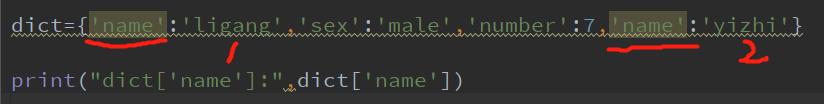

​		输出结果：

​		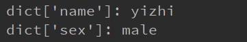

​		可以看出位置2处的值将位置1处的值覆盖了。

​		**2）键必须不可变，所以可以用数字、字符串或元组充当，而用列表就不行**

```
dict = {['Name']: 'Runoob', 'Age': 7}
 
print ("dict['Name']: ", dict['Name'])
```

​		这里的Name是列表类型。出错结果如下：

```
Traceback (most recent call last):
  File "test.py", line 3, in <module>
    dict = {['Name']: 'Runoob', 'Age': 7}
TypeError: unhashable type: 'list'
```

​		**但是，**列表中可以嵌套字典，即字典列表；

​		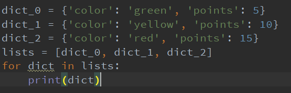

​		输出结果：

​		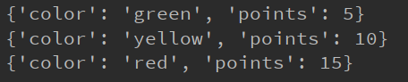


------------------------------------------------------------------------------

#### 1.5  字典内置函数&方法

​		内置函数：

| 序号 | 函数及描述                                                   |
| :--: | ------------------------------------------------------------ |
|  1   | len(dict) 计算字典元素个数，即键的总数。                     |
|  2   | str(dict) 输出字典，以可打印的字符串表示。                   |
|  3   | type(variable) 返回输入的变量类型，如果变量是字典就返回字典类型。 |

​		方法：

| 序号 | 函数及描述                                                   |
| :--: | :----------------------------------------------------------- |
|  1   | [radiansdict.clear()](https://www.runoob.com/python3/python3-att-dictionary-clear.html) 删除字典内所有元素 |
|  2   | [radiansdict.copy()](https://www.runoob.com/python3/python3-att-dictionary-copy.html) 返回一个字典的浅复制 |
|  3   | [radiansdict.fromkeys()](https://www.runoob.com/python3/python3-att-dictionary-fromkeys.html) 创建一个新字典，以序列seq中元素做字典的键，val为字典所有键对应的初始值 |
|  4   | [radiansdict.get(key, default=None)](https://www.runoob.com/python3/python3-att-dictionary-get.html) 返回指定键的值，如果值不在字典中返回default值 |
|  5   | [key in dict](https://www.runoob.com/python3/python3-att-dictionary-in.html) 如果键在字典dict里返回true，否则返回false |
|  6   | [radiansdict.items()](https://www.runoob.com/python3/python3-att-dictionary-items.html) 以列表返回可遍历的(键, 值) 元组数组 |
|  7   | [radiansdict.keys()](https://www.runoob.com/python3/python3-att-dictionary-keys.html) 返回一个迭代器，可以使用 list() 来转换为列表 |
|  8   | [radiansdict.setdefault(key, default=None)](https://www.runoob.com/python3/python3-att-dictionary-setdefault.html) 和get()类似, 但如果键不存在于字典中，将会添加键并将值设为default |
|  9   | [radiansdict.update(dict2)](https://www.runoob.com/python3/python3-att-dictionary-update.html) 把字典dict2的键/值对更新到dict里 |
|  10  | [radiansdict.values()](https://www.runoob.com/python3/python3-att-dictionary-values.html) 返回一个迭代器，可以使用 list() 来转换为列表 |
|  11  | pop(key\[,default\])(https://www.runoob.com/python3/python3-att-dictionary-pop.html) 删除字典给定键 key 所对应的值，返回值为被删除的值。key值必须给出。 否则，返回default值。 |
|  12  | [popitem()](https://www.runoob.com/python3/python3-att-dictionary-popitem.html) 随机返回并删除字典中的一对键和值(一般删除末尾对)。 |


## 2  Set（集合）

#### 2.1  定义

​		集合是一个无序的不重复元素序列，可以使用**花括号{}**或者**set（）函数**创建集合。

​		**注意：**创建一个空集合必须用set（）而不是{}，因为{}是用来创建以一个空字典。

​		创建格式：

```
parame = {value01,value02,...}
或者
set(value)
```

​		集合之间的运算与数学集合之间的运算类似：

```
>>> a = set('abracadabra')
>>> b = set('alacazam')
>>> a                                  
{'a', 'r', 'b', 'c', 'd'}
>>> a - b                              # 集合a中包含而集合b中不包含的元素
{'r', 'd', 'b'}
>>> a | b                              # 集合a或b中包含的所有元素
{'a', 'c', 'r', 'd', 'b', 'm', 'z', 'l'}
>>> a & b                              # 集合a和b中都包含了的元素
{'a', 'c'}
>>> a ^ b                              # 不同时包含于a和b的元素
{'r', 'd', 'b', 'm', 'z', 'l'}
```

​		**set()中参数注意事项：**

```
1.创建一个含有一个元素的集合
	>>> my_set = set(('apple',))
	>>> my_set
	{'apple'}
2.创建一个含有多个元素的集合
	>>> my_set = set(('apple','pear','banana'))
	>>> my_set
	{'apple', 'banana', 'pear'}
3.如无必要，不要写成如下形式
	>>> my_set = set('apple')
	>>> my_set
	{'l', 'e', 'p', 'a'}
	>>> my_set1 = set(('apple'))
	>>> my_set1
	{'l', 'e', 'p', 'a'}

```


------------------------------------------------------------------------------------------------------

#### 2.2  基本操作

​		**添加元素**

```
s.add(x)
```

​		将元素x添加到集合s中，如果元素已经存在，则不进行任何操作。

```
s.update(x)
```

​		同样可以添加元素，且参数可以是列表、元组、字典等。

​		***注意：第二种方式添加元素时，需要在小括号内加花括号，否则字符串会被拆分成单个字母进行存储。***

​		**s.update( "字符串" ) 与 s.update( {"字符串"} ) 含义不同:**

-  **s.update( {"字符串"} )** 将字符串添加到集合中，有重复的会忽略。

-  **s.update( "字符串" )** 将字符串拆分单个字符后，然后再一个个添加到集合中，有重复的会忽略。

  例如：

​		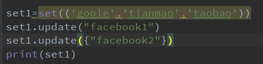

​		输出结果：

​		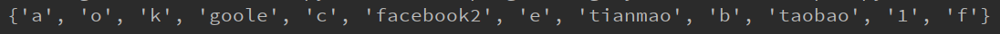

​		当x有多个时，使用**逗号**分开。

​		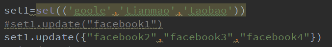

​		输出结果：

​		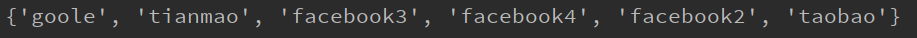


​		**移除元素**

```
s.remove(x)
```

​		将元素x从集合s中移除，如果元素不在集合中，则会发生错误。

```
s.discard(x)
```

​		第二种移除集合中元素的方法，这种方式碰到元素不在集合中，不会发生错误。

```
s.pop()
```

​		第三种方式用于设置随机删除集合中的一个元素。

​		例如：

​		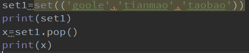

​		输出结果：

​		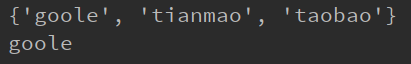

​		**注意：**在***交互模式***，pop是删除集合的第一个元素（排序后的集合的第一个元素）

​		

​		**清空集合**

```
s.clear()
```


​		**判断元素是否在集合中存在**

```
x in s
```

​		

------------------------------------------------------------------------------------------------

#### 2.3  计算集合元素个数

```
len(s)
```

​		

------------------------------------------------------------------------------------------------------------

#### 2.4  集合内置方法		

| 方法                                                         | 描述                                                         |
| ------------------------------------------------------------ | ------------------------------------------------------------ |
| [add()](https://www.runoob.com/python3/ref-set-add.html)     | 为集合添加元素                                               |
| [clear()](https://www.runoob.com/python3/ref-set-clear.html) | 移除集合中的所有元素                                         |
| [copy()](https://www.runoob.com/python3/ref-set-copy.html)   | 拷贝一个集合                                                 |
| [difference()](https://www.runoob.com/python3/ref-set-difference.html) | 返回多个集合的差集                                           |
| [difference_update()](https://www.runoob.com/python3/ref-set-difference_update.html) | 移除集合中的元素，该元素在指定的集合也存在。                 |
| [discard()](https://www.runoob.com/python3/ref-set-discard.html) | 删除集合中指定的元素                                         |
| [intersection()](https://www.runoob.com/python3/ref-set-intersection.html) | 返回集合的交集                                               |
| [intersection_update()](https://www.runoob.com/python3/ref-set-intersection_update.html) | 删除集合中的元素，该元素在指定的集合中不存在。               |
| [isdisjoint()](https://www.runoob.com/python3/ref-set-isdisjoint.html) | 判断两个集合是否包含相同的元素，如果没有返回 True，否则返回 False。 |
| [issubset()](https://www.runoob.com/python3/ref-set-issubset.html) | 判断指定集合是否为该方法参数集合的子集。                     |
| [issuperset()](https://www.runoob.com/python3/ref-set-issuperset.html) | 判断该方法的参数集合是否为指定集合的子集                     |
| [pop()](https://www.runoob.com/python3/ref-set-pop.html)     | 随机移除元素                                                 |
| [remove()](https://www.runoob.com/python3/ref-set-remove.html) | 移除指定元素                                                 |
| [symmetric_difference()](https://www.runoob.com/python3/ref-set-symmetric_difference.html) | 返回两个集合中不重复的元素集合。                             |
| [symmetric_difference_update()](https://www.runoob.com/python3/ref-set-symmetric_difference_update.html) | 移除当前集合中在另外一个指定集合相同的元素，并将另外一个指定集合中不同的元素插入到当前集合中。 |
| [union()](https://www.runoob.com/python3/ref-set-union.html) | 返回两个集合的并集                                           |
| [update()](https://www.runoob.com/python3/ref-set-update.html) | 给集合添加元素                                               |

​	

------------------------------------------------------------------------

#### 2.6  集合用set.pop()方法删除元素

​		1、对于 python 中列表 list、tuple 类型中的元素，转换集合是会去掉重复的元素，如下:

```
>>> list = [1,1,2,3,4,5,3,1,4,6,5]
>>> set(list)
{1, 2, 3, 4, 5, 6}
>>> tuple = (2,3,5,6,3,5,2,5)
>>> set(tuple)
{2, 3, 5, 6}
```

​		2、集合对 list 和 tuple 具有排序(升序)，举例如下:

```
>>> set([9,4,5,2,6,7,1,8])
{1, 2, 4, 5, 6, 7, 8, 9}
>>> set((9,4,5,2,6,7,1,8))
{1, 2, 4, 5, 6, 7, 8, 9}
```

​		**3、集合的 set.pop() 的不同认为**

​		有人认为 set.pop() 是随机删除集合中的一个元素、我在这里说句非也！对于是字典和字符转换的集合是随机删除元素的。当集合是由列表和元组组成时、set.pop() 是从左边删除元素的如下:

​		元组实例（列表类似）：

```
x=set( (2,2,3,4,9,5,3,7,4,6,5))
print(x)
print(x.pop())
print(x)
print(x.pop())
print(x)
```

​		输出结果：

```
{2, 3, 4, 5, 6, 7, 9}
2
{3, 4, 5, 6, 7, 9}
3
{4, 5, 6, 7, 9}
```

​	

## 3、条件控制

#### 3.1  if语句

​		if语句的一般形式，如下：

```
if condition_1:
    statement_block_1
elif condition_2:
    statement_block_2
else:
    statement_block_3
```

​		Python 中用 **elif** 代替了 **else if**，所以if语句的关键字为：**if – elif – else**。

​		**注意：**

​		1、每个条件后面要使用冒号 **:**，表示接下来是满足条件后要执行的语句块。

​		2、使用缩进来划分语句块，相同缩进数的语句在一起组成一个语句块。

​		3、在Python中没有switch – case语句。

​		Gif演示：


​		**if嵌套**

​		在嵌套 if 语句中，可以把 if...elif...else 结构放在另外一个 if...elif...else 结构中

```
if 表达式1:
    语句
    if 表达式2:
        语句
    elif 表达式3:
        语句
    else:
        语句
elif 表达式4:
    语句
else:
    语句
```

​		**如果if语句中的条件过长，可以用接续符\ 来换行。注意：\ 后的一行要缩进。**


## 4、循环语句

​		python中的循环语句有for和while。

#### 4.1  while循环

​		**一般形式：**

```
while 判断条件：
    语句
```

​		Gif演示：


​		***注意：***

​		1、***在python中没有do..while循环***

​		2、使用ctrl+c来退出无限循环。（无限循环在服务器上客户端的实时请求非常有用）

​		

------------------------------------------------------------------------------------------------------------------

​		**while循环使用else语句**

​		在while…else在条件语句为false时执行else的语句块：


------------------------------------------------------------------------------------------------

#### 4.2  for语句

​		for循环可以遍历任何序列的项目，如一个列表或者一个字符串。

​		一般格式：

```
for <variable> in <sequence>:
    <statements>
else:
    <statements>
```

​		在for循环中使用**break语句**，break语句用于跳出当前循环体：

```
sites = ["Baidu", "Google","Runoob","Taobao"]
for site in sites:
    if site == "Runoob":
        print("ok，No.3!")
        break
    print("循环数据 " + site)
else:
    print("没有循环数据!")
print("完成循环!")
```

​		**range（）函数**

- 如果需要遍历数字序列，可以使用内置range（）函数，它会生成数列。
- 也可以使用range指定区间的值，或者指定不同的增量，即步长。
- 结合range（）和len（）函数可以遍历一个序列的索引。

​		

------------------------------------------------------------------------------------------------------------------

#### 4.3  break和continue语句及循环中的else子句

​		break 语句可以跳出 for 和 while 的循环体。如果你从 for 或 while 循环中终止，任何对应的循环 else 块将不执行。

​		continue语句被用来告诉Python跳过当前循环块中的剩余语句，然后继续进行下一轮循环。

​		循环语句可以有 else 子句，它在穷尽列表(以for循环)或条件变为 false (以while循环)导致循环终止时被执行,但循环被break终止时不执行。


------------------------------------------------------------------------------------------------------

#### 4.4  pass语句

​		pass是空语句，是为了保持程序结构的完整性，防止语法错误。

​		pass不做任何事，一般用做占位语句。


