## Task4
## 1  函数

​		内建函数，如print()；用户自定义函数，即自己创建函数。

#### 1.1  定义一个函数

​		一般格式：

```
def 函数名（参数列表）:
    函数体
    
#默认情况下，参数值和参数名称是按函数声明中定义地顺序匹配起来的。

或者：————————————————————————————————
def function_name([arguments]):
	"optional documentation string"		#Docstring是函数说明，可以通过print(function_name.__doc__)l来查看
	function_suite
```

​		定义函数的规则：

- 函数代码块以**def**关键词开头，后接函数名和圆括号()。

- 任何传入参数和自变量必须放在圆括号中间，圆括号之间用于定义参数。

- 函数的第一行语句可以选择性地使用文档字符串—用于存放函数说明。

- 函数内容以冒号(:)开始，并且缩进。

- **return[表达式]**结束函数，选择性地返回一个值给调用方。不带表达式地return相当于返回None。

  例如：

```
def add1(x):
    'addfunction加法'
    return (x+x)

y=add1(2)
print(y)
print(add1.__doc__) #查看函数说明
```

​		输出结果：

```
4
addfunction加法
```


​		实例：计算长方形周长

```
def zhouchang (w,h):  #自定义周长函数
    return (w+h)*2
w,h=input("please input w and h: ").split()  #请求输入长和宽
print("w=",w,'h=',h,'zhouchang=',zhouchang(int(w),int(h)))
```

​		注意：上面的输入需要注意这是多参数接收input输入，需要使用split（）。

​					另外，input返回的是字符串类型，直接输入函数中计算，是当作字符串的操作；

​					所以需要通过int（）转换成整数型计算。	

​		输出结果：

​		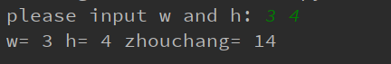

​		

------------------------------------------------------------------------------------------

#### 1.2  函数调用

​		定义一个函数：给了函数一个名称，指定了函数里包含的参数、代码结构。


------------------------------------------------------------------

#### 1.3  参数传递

​		类型属于对象，变量是没有类型的：

```
a=[1,2,3]

a="Runoob"
```

​		以上代码中，**[1,2,3]** 是 List 类型，**"Runoob"** 是 String 类型，而变量 a 是没有类型，她仅仅是一个对象的引用（一个指针），可以是指向 List 类型对象，也可以是指向 String 类型对象。

​	

------------------------------------------------------------------------------------------

#### 1.4  可更改与不可更改对象

​		在python中，strings、tuples和numbers是不可更改的对象，而list、dict等则是可以修改的对象。

- **不可变类型：**

  变量赋值 a=5 后再赋值 a=10，这里实际是新生成一个 int 值对象 10，再让 a 指向它，而 5 被丢弃，不是改变a的值，相当于新生成了a。

- **可变类型：**

  变量赋值 la=[1,2,3,4] 后再赋值 la[2]=5 则是将 list la 的第三个元素值更改，本身la没有动，只是其内部的一部分值被修改了。


​		**python函数的参数传递：**		

- **不可变类型：**类似 c++ 的值传递，如 整数、字符串、元组。如fun（a），传递的只是a的值，没有影响a对象本身。比如在 fun（a）内部修改 a 的值，只是修改另一个复制的对象，不会影响 a 本身。

- **可变类型：**类似 c++ 的引用传递，如 列表，字典。如 fun（la），则是将 la 真正的传过去，修改后fun外部的la也会受影响。

  ***python中一切都是对象，严格意义我们不能说值传递还是引用传递，应该说传不可变对象和可变对象。***

​		

------------------------------------------------------------------------------------

#### 1.5  参数

​		调用函数时可使用的正式参数类型：

- 必需参数

- 关键字参数

- 默认参数

- 不定长参数

  ​	

  **必需参数：**

  必需参须以正确的顺序传入函数，调用时的数量必须和声明时的一样。


​		**关键字参数：**

​		关键字参数和函数调用关系紧密，函数调用使用关键字

​		使用关键字参数允许函数调用时参数的顺序与声明时不一致，因为python解释器能够用参数名匹配参数值。

```
#可写函数说明
def printinfo( name, age ):
   "打印任何传入的字符串"
   print ("名字: ", name)
   print ("年龄: ", age)
   return
 
#调用printinfo函数
printinfo( age=50, name="runoob" )
```


​		**默认参数：**

​		调用函数时，如果没有传递参数，则会使用默认参数。

​		*默认参数必须放在最后面。*

​		*默认参数一般在函数定义时使用，关键字参数一般在函数调用时使用。*


​		**不定长参数：**

​		你可能需要一个函数能处理比当初声明时更多的参数。这些参数叫做不定长参数，和上述 2 种参数不同，声明时不会命名。

​		基本语法如下：

```
def functionname([formal_args,] *var_args_tuple ):
   "函数_文档字符串"
   function_suite
   return [expression]
```

​		*加了星号 ***** 的参数会以元组(tuple)的形式导入，存放所有未命名的变量参数。*

​		如果在函数调用时没有指定参数，它就是一个空元组。我们也可以不向函数传递未命名的变量。

​		还有一种就是参数带两个星号 ***\***基本语法如下：

```
def functionname([formal_args,] **var_args_dict ):
   "函数_文档字符串"
   function_suite
   return [expression]
```

​		加了两个星号 ***\*** 的参数会以字典的形式导入。

​		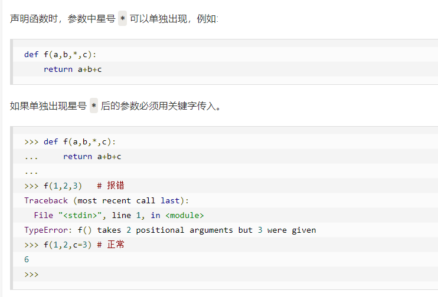


​		**匿名函数：**

​		python 使用 lambda 来创建匿名函数。

​		所谓匿名，意即不再使用 def 语句这样标准的形式定义一个函数。

- lambda 只是一个表达式，函数体比 def 简单很多。

- lambda的主体是一个表达式，而不是一个代码块。仅仅能在lambda表达式中封装有限的逻辑进去。

- lambda 函数拥有自己的命名空间，且不能访问自己参数列表之外或全局命名空间里的参数。

- 虽然lambda函数看起来只能写一行，却不等同于C或C++的内联函数，后者的目的是调用小函数时不占用栈内存从而增加运行效率。

  

  lambda 函数的语法只包含一个语句，如下：

```
lambda [arg1 [,arg2,.....argn]]:expression
```

​		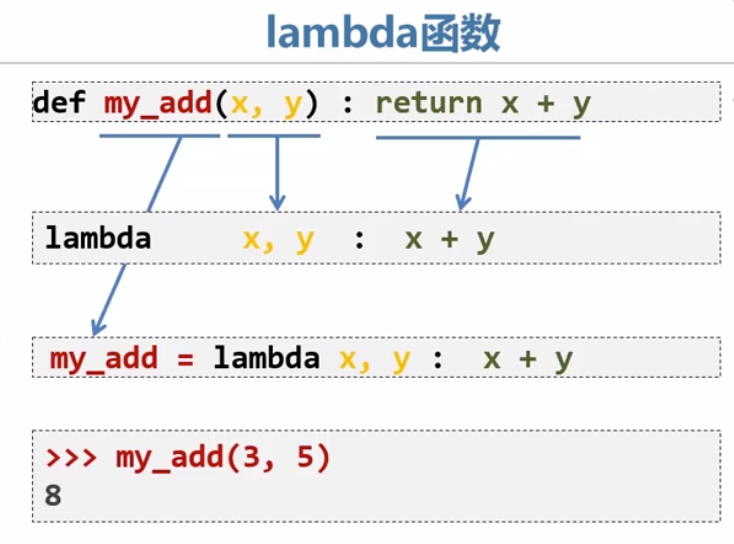


------------------------------------------------------------------------------

#### 1.6  return语句

​		**return [表达式]** 语句用于退出函数，选择性地向调用方返回一个表达式。不带参数值的return语句返回None。

​		函数返回值的注意事项: 不同于 C 语言，Python 函数可以返回多个值，多个值以元组的方式返回:

```
def fun(a,b):    
    "返回多个值，结果以元组形式表示"
    return a,b,a+b
print(fun(1,2))
```

​		输出结果：

```
(1, 2, 3)
```


------------------------------------------------------------------------------------

#### 1.7  变量作用域

​		变量的作用域决定了在哪一部分程序可以访问哪个特定的变量名称。Python的作用域一共有4种，分别是：

- L （Local） 局部作用域

- E （Enclosing） 闭包函数外的函数中

- G （Global） 全局作用域

- B （Built-in） 内置作用域（内置函数所在模块的范围）

  以 L –> E –> G –>B 的规则查找，即：在局部找不到，便会去局部外的局部找（例如闭包），再找不到就会去全局找，再者去内置中找。

```
g_count = 0  # 全局作用域
def outer():
    o_count = 1  # 闭包函数外的函数中
    def inner():
        i_count = 2  # 局部作用域
```

​		内置作用域是通过一个名为 builtin 的标准模块来实现的，但是这个变量名自身并没有放入内置作用域内，所以必须导入这个文件才能够使用它。在Python3.0中，可以使用以下的代码来查看到底预定义了哪些变量:

```
>>> import builtins
>>> dir(builtins)
```

​		Python 中只有模块（module），类（class）以及函数（def、lambda）才会引入新的作用域，其它的代码块（如 if/elif/else/、try/except、for/while等）是不会引入新的作用域的，也就是说这些语句内定义的变量，外部也可以访问。


​		**全局变量和局部变量**

​		局部变量只能在其被声明的函数内部访问，而全局变量可以在整个程序范围内访问。

​		调用函数时，所有在函数内声明的变量名称都将被加入到作用域中。


​		**global和nonlocal关键字**

​		当内部作用域想修改外部作用域的变量时，就要用到global和nonlocal关键字了。

​		**global** 关键字会跳过中间层直接将嵌套作用域内的局部变量变为全局变量:

​		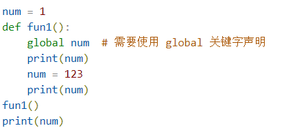

​		如果要修改嵌套作用域（enclosing 作用域，外层非全局作用域）中的变量则需要 nonlocal 关键字了。


## 2  File（文件）

#### 2.1  open（）方法

​		**注意：**使用 open() 方法一定要保证关闭文件对象，即调用 close() 方法。

​		open() 函数常用形式是接收两个参数：**文件名(file)**和**模式(mode)**。open()返回一个file object（可迭代）。

```
open(file, mode='r')
```

​		完整的语法格式为：

```
open(file, mode='r', buffering=-1, encoding=None, errors=None, newline=None, closefd=True, opener=None)
```

​		参数说明:

- file: 必需，文件路径（相对或者绝对路径）。
- mode: 可选，文件打开模式
- buffering: 设置缓冲，二进制文件可以不使用缓冲，但文本文件必须使用缓冲。
- encoding: 一般使用utf8
- errors: 报错级别
- newline: 区分换行符
- closefd: 传入的file参数类型
- opener:


​		mode参数有：

| 模式 | 描述                                                         |
| :--: | ------------------------------------------------------------ |
|  t   | 文本模式 (默认)。                                            |
|  x   | 写模式，新建一个文件，如果该文件已存在则会报错。             |
|  b   | 二进制模式。                                                 |
|  +   | 打开一个文件进行更新(可读可写)。                             |
|  U   | 通用换行模式（不推荐）。                                     |
|  r   | 以只读方式打开文件。文件的指针将会放在文件的开头。这是默认模式。 |
|  rb  | 以二进制格式打开一个文件用于只读。文件指针将会放在文件的开头。这是默认模式。一般用于非文本文件如图片等。 |
|  r+  | 打开一个文件用于读写。文件指针将会放在文件的开头。           |
| rb+  | 以二进制格式打开一个文件用于读写。文件指针将会放在文件的开头。一般用于非文本文件如图片等。 |
|  w   | 打开一个文件只用于写入。如果该文件已存在则打开文件，并从开头开始编辑，即原有内容会被删除。如果该文件不存在，创建新文件。 |
|  wb  | 以二进制格式打开一个文件只用于写入。如果该文件已存在则打开文件，并从开头开始编辑，即原有内容会被删除。如果该文件不存在，创建新文件。一般用于非文本文件如图片等。 |
|  w+  | 打开一个文件用于读写。如果该文件已存在则打开文件，并从开头开始编辑，即原有内容会被删除。如果该文件不存在，创建新文件。 |
| wb+  | 以二进制格式打开一个文件用于读写。如果该文件已存在则打开文件，并从开头开始编辑，即原有内容会被删除。如果该文件不存在，创建新文件。一般用于非文本文件如图片等。 |
|  a   | 打开一个文件用于追加。如果该文件已存在，文件指针将会放在文件的结尾。也就是说，新的内容将会被写入到已有内容之后。如果该文件不存在，创建新文件进行写入。 |
|  ab  | 以二进制格式打开一个文件用于追加。如果该文件已存在，文件指针将会放在文件的结尾。也就是说，新的内容将会被写入到已有内容之后。如果该文件不存在，创建新文件进行写入。 |
|  a+  | 打开一个文件用于读写。如果该文件已存在，文件指针将会放在文件的结尾。文件打开时会是追加模式。如果该文件不存在，创建新文件用于读写。 |
| ab+  | 以二进制格式打开一个文件用于追加。如果该文件已存在，文件指针将会放在文件的结尾。如果该文件不存在，创建新文件用于读写。 |

​			

|    模式    |  r   |  r+  |  w   |  w+  |  a   |  a+  |
| :--------: | :--: | :--: | :--: | :--: | :--: | :--: |
|     读     |  +   |  +   |      |  +   |      |  +   |
|     写     |      |  +   |  +   |  +   |  +   |  +   |
|    创建    |      |      |  +   |  +   |  +   |  +   |
|    覆盖    |      |      |  +   |  +   |      |      |
| 指针在开始 |  +   |  +   |  +   |  +   |      |      |
| 指针在结尾 |      |      |      |      |  +   |  +   |


------------------------------------------

#### 2.2  file对象方法

| 序号 | 方法及描述                                                   |
| :--- | :----------------------------------------------------------- |
| 1    | [file.close()](https://www.runoob.com/python3/python3-file-close.html)关闭文件。关闭后文件不能再进行读写操作。 |
| 2    | [file.flush()](https://www.runoob.com/python3/python3-file-flush.html)刷新文件内部缓冲，直接把内部缓冲区的数据立刻写入文件, 而不是被动的等待输出缓冲区写入。 |
| 3    | [file.fileno()](https://www.runoob.com/python3/python3-file-fileno.html)返回一个整型的文件描述符(file descriptor FD 整型), 可以用在如os模块的read方法等一些底层操作上。 |
| 4    | [file.isatty()](https://www.runoob.com/python3/python3-file-isatty.html)如果文件连接到一个终端设备返回 True，否则返回 False。 |
| 5    | [file.next()](https://www.runoob.com/python3/python3-file-next.html)**Python 3 中的 File 对象不支持 next() 方法。**返回文件下一行。 |
| 6    | file.read(\[size\])(https://www.runoob.com/python3/python3-file-read.html)从文件读取指定的字节数，如果未给定或为负则读取所有。 |
| 7    | file.readline(\[size\])(https://www.runoob.com/python3/python3-file-readline.html)读取整行，包括 "\n" 字符。 |
| 8    | file.readlines(\[sizeint\])(https://www.runoob.com/python3/python3-file-readlines.html)读取所有行并返回列表，若给定sizeint>0，返回总和大约为sizeint字节的行, 实际读取值可能比 sizeint 较大, 因为需要填充缓冲区。 |
| 9    | file.seek(offset\[, whence\])(https://www.runoob.com/python3/python3-file-seek.html)设置文件当前位置 |
| 10   | [file.tell()](https://www.runoob.com/python3/python3-file-tell.html)返回文件当前位置。 |
| 11   | file.truncate(\[size\])(https://www.runoob.com/python3/python3-file-truncate.html)从文件的首行首字符开始截断，截断文件为 size 个字符，无 size 表示从当前位置截断；截断之后后面的所有字符被删除，其中 Widnows 系统下的换行代表2个字符大小。 |
| 12   | [file.write(str)](https://www.runoob.com/python3/python3-file-write.html)将字符串写入文件，返回的是写入的字符长度。 |
| 13   | [file.writelines(sequence)](https://www.runoob.com/python3/python3-file-writelines.html)向文件写入一个序列字符串列表，如果需要换行则要自己加入每行的换行符。 |

​		**f.read()**

​		为了读取一个文件的内容，调用 f.read(size), 这将读取一定数目的数据, 然后作为字符串或字节对象返回。

​	

​		**file.readline()**

​		f.readline() 会从文件中读取单独的一行。换行符为 '\n'。f.readline() 如果返回一个空字符串, 说明已经已经读取到最后一行。


​		**f.readlines()**

​		f.readlines() 将返回该文件中包含的所有行。

​		如果设置可选参数 sizehint, 则读取指定长度的字节, 并且将这些字节按行分割。

​		

​		**f.write()**

​		f.write(string) 将 string 写入到文件中, 然后返回写入的字符数。

​		如果要写入一些不是字符串的东西, 在写入其他类型的对象之前，需要先把它们转化为字符串（在文本模式下）或者字节对象（在二进制模式下）：

```
#!/usr/bin/python3

# 打开一个文件
f = open("/tmp/foo1.txt", "w")

value = ('www.runoob.com', 14)
s = str(value)
f.write(s)

# 关闭打开的文件
f.close()
```


​		**f.tell()**

​		f.tell() 返回文件对象当前所处的位置, 它是从文件开头开始算起的字节数。

​		

​		**f.seek()**

​		如果要改变文件当前的位置, 可以使用 f.seek(offset, from_what) 函数。

​		from_what 的值, 如果是 0 表示开头, 如果是 1 表示当前位置, 2 表示文件的结尾，例如：

- seek(x,0) ： 从起始位置即文件首行首字符开始移动 x 个字符

- seek(x,1) ： 表示从当前位置往后移动x个字符

- seek(-x,2)：表示从文件的结尾往前移动x个字符

  from_what 值为默认为0，即文件开头。下面给出一个完整的例子：

```
>>> f = open('/tmp/foo.txt', 'rb+')
>>> f.write(b'0123456789abcdef')
16
>>> f.seek(5)     # 移动到文件的第六个字节
5
>>> f.read(1)
b'5'
>>> f.seek(-3, 2) # 移动到文件的倒数第三字节
13
>>> f.read(1)
b'd'
```


​		**f.close()**

​		在文本文件中 (那些打开文件的模式下没有 b 的), 只会相对于文件起始位置进行定位。

​		当你处理完一个文件后, 调用 f.close() 来关闭文件并释放系统的资源，如果尝试再调用该文件，则会抛出异常。


------------------------------------------------------------------------

#### 2.3  读写方式

​		在处理文件对象时，最好使用**with关键字**。优点是当子句体结束后文件会正确关闭，即使在某个时刻引发了异常。而且使用with相比等效的try-finally代码块要简短得多。

```
>>> with open('workfile') as f:
...     read_data = f.read()
>>> f.closed
True
```

​		如果没有使用with关键字，那么应该调用**f.close（）**来关闭文件并立即释放它使用的所有系统资源。如果没有显式地关闭文件，python的垃圾回收器最终将销毁该对象并为你关闭打开的文件，但这个文件可能会保持打开状态一段时间。


​		一般读写方法：

```
#写
with open('test.txt', 'w', encoding='utf-8') as f:
    f.write('test')
#读
with open('test.txt', 'r', encoding='utf-8') as f:
    f.readlines()
```

​		执行完自动close，避免忘记关闭文件导致资源的占用。


------------------------------------------------------------------------

#### 2.4  文件格式操作

​		**1）使用json保存结构化数据**

​		字符串可以很轻松地写入文件并从文件中读取出来。数字可能会费点劲，因为 `read()` 方法只能返回字符串，这些字符串必须传递给类似 [`int()`](https://docs.python.org/zh-cn/3/library/functions.html#int) 的函数，它会接受类似 `'123'` 这样的字符串并返回其数字值 123。

​		如果想保存嵌套列表和字典这些复杂的数据类型时，手动解析和序列化会变得复杂。

​		Python允许使用JSON的流行数据交换格式，

​		名为 [`json`](https://docs.python.org/zh-cn/3/library/json.html#module-json) 的标准模块可以采用 Python 数据层次结构，并将它们转化为字符串表示形式；这个过程称为 *serializing* 。

​		从字符串表示中重建数据称为 *deserializing* 。在序列化和反序列化之间，表示对象的字符串可能已存储在文件或数据中，或通过网络连接发送到某个远程机器。

​		例如：

```
>>> import json
>>> json.dumps([1, 'simple', 'list'])
'[1, "simple", "list"]'
```

​		[`dumps()`](https://docs.python.org/zh-cn/3/library/json.html#json.dumps) 函数的另一个变体叫做 [`dump()`](https://docs.python.org/zh-cn/3/library/json.html#json.dump) ，它只是将对象序列化为 [text file](https://docs.python.org/zh-cn/3/glossary.html#term-text-file) 。因此，如果 `f` 是一个 [text file](https://docs.python.org/zh-cn/3/glossary.html#term-text-file) 对象，我们可以这样做:

```
json.dump(x, f)
```

​		要再次解码对象，如果 `f` 是一个打开的以供阅读的 [text file](https://docs.python.org/zh-cn/3/glossary.html#term-text-file) 对象:

​		这种简单的序列化技术可以处理列表和字典，但是在JSON中序列化任意类的实例需要额外的努力。 [`json`](https://docs.python.org/zh-cn/3/library/json.html#module-json) 模块的参考包含对此的解释。


​		**2）CSV文件**

​		[`csv`](#module-csv) 模块中的 [`reader`](#csv.reader) 类和 [`writer`](#csv.writer) 类可用于读写序列化的数据。也可使用 [`DictReader`](#csv.DictReader) 类和 [`DictWriter`](#csv.DictWriter) 类以字典的形式读写数据。

​		**读取CSV文件：**

​		`reader`(*csvfile*, *dialect='excel'*, ***fmtparams*)

​		需要先导入csv模块；

```
import csv
csvfile=csv.reader(open('C:/Users/ligang/Desktop/test.csv','r'))
print(csvfile)
for stu in csvfile:
    print(stu)
```

​		输出结果：

​		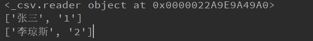

​		*注意：建立的csv文件必须注意编码格式（UTF-8），否则会出现异常。*

​		

​		**写入CSV文件：**

​		`writer`(*csvfile*, *dialect='excel'*, ***fmtparams*)

​		"newline="就是说因为我们的csv文件的类型，如果不加这个东西，当我们写入东西的时候，就会出现空行。

​		dialect就是定义一下文件的类型。

​		写入的方法是writerow，通过写入模式对象，调用方法进行写入

```
import csv
stu1=['marry',26]
stu2=['bob',23]
out=open('C:/Users/ligang/Desktop/test.csv','a',newline='')
csvwrite=csv.writer(out,dialect='excel')
csvwrite.writerow(stu1)
csvwrite.writerow(stu2)
print("ok!")
```

​		输出结果：

​		


## 3  OS模块

​		**os** 模块提供了非常丰富的方法用来处理文件和目录。

| 序号 | 方法及描述                                                   |
| :--- | :----------------------------------------------------------- |
| 1    | [os.access(path, mode)](https://www.runoob.com/python3/python3-os-access.html) 检验权限模式 |
| 2    | [os.chdir(path)](https://www.runoob.com/python3/python3-os-chdir.html) 改变当前工作目录 |
| 3    | [os.chflags(path, flags)](https://www.runoob.com/python3/python3-os-chflags.html) 设置路径的标记为数字标记。 |
| 4    | [os.chmod(path, mode)](https://www.runoob.com/python3/python3-os-chmod.html) 更改权限 |
| 5    | [os.chown(path, uid, gid)](https://www.runoob.com/python3/python3-os-chown.html) 更改文件所有者 |
| 6    | [os.chroot(path)](https://www.runoob.com/python3/python3-os-chroot.html) 改变当前进程的根目录 |
| 7    | [os.close(fd)](https://www.runoob.com/python3/python3-os-close.html) 关闭文件描述符 fd |
| 8    | [os.closerange(fd_low, fd_high)](https://www.runoob.com/python3/python3-os-closerange.html) 关闭所有文件描述符，从 fd_low (包含) 到 fd_high (不包含), 错误会忽略 |
| 9    | [os.dup(fd)](https://www.runoob.com/python3/python3-os-dup.html) 复制文件描述符 fd |
| 10   | [os.dup2(fd, fd2)](https://www.runoob.com/python3/python3-os-dup2.html) 将一个文件描述符 fd 复制到另一个 fd2 |
| 11   | [os.fchdir(fd)](https://www.runoob.com/python3/python3-os-fchdir.html) 通过文件描述符改变当前工作目录 |
| 12   | [os.fchmod(fd, mode)](https://www.runoob.com/python3/python3-os-fchmod.html) 改变一个文件的访问权限，该文件由参数fd指定，参数mode是Unix下的文件访问权限。 |
| 13   | [os.fchown(fd, uid, gid)](https://www.runoob.com/python3/python3-os-fchown.html) 修改一个文件的所有权，这个函数修改一个文件的用户ID和用户组ID，该文件由文件描述符fd指定。 |
| 14   | [os.fdatasync(fd)](https://www.runoob.com/python3/python3-os-fdatasync.html) 强制将文件写入磁盘，该文件由文件描述符fd指定，但是不强制更新文件的状态信息。 |
| 15   | [os.fdopen(fd[, mode[, bufsize\]])](https://www.runoob.com/python3/python3-os-fdopen.html) 通过文件描述符 fd 创建一个文件对象，并返回这个文件对象 |
| 16   | [os.fpathconf(fd, name)](https://www.runoob.com/python3/python3-os-fpathconf.html) 返回一个打开的文件的系统配置信息。name为检索的系统配置的值，它也许是一个定义系统值的字符串，这些名字在很多标准中指定（POSIX.1, Unix 95, Unix 98, 和其它）。 |
| 17   | [os.fstat(fd)](https://www.runoob.com/python3/python3-os-fstat.html) 返回文件描述符fd的状态，像stat()。 |
| 18   | [os.fstatvfs(fd)](https://www.runoob.com/python3/python3-os-fstatvfs.html) 返回包含文件描述符fd的文件的文件系统的信息，像 statvfs() |
| 19   | [os.fsync(fd)](https://www.runoob.com/python3/python3-os-fsync.html) 强制将文件描述符为fd的文件写入硬盘。 |
| 20   | [os.ftruncate(fd, length)](https://www.runoob.com/python3/python3-os-ftruncate.html) 裁剪文件描述符fd对应的文件, 所以它最大不能超过文件大小。 |
| 21   | [os.getcwd()](https://www.runoob.com/python3/python3-os-getcwd.html) 返回当前工作目录 |
| 22   | [os.getcwdu()](https://www.runoob.com/python3/python3-os-getcwdu.html) 返回一个当前工作目录的Unicode对象 |
| 23   | [os.isatty(fd)](https://www.runoob.com/python3/python3-os-isatty.html) 如果文件描述符fd是打开的，同时与tty(-like)设备相连，则返回true, 否则False。 |
| 24   | [os.lchflags(path, flags)](https://www.runoob.com/python3/python3-os-lchflags.html) 设置路径的标记为数字标记，类似 chflags()，但是没有软链接 |
| 25   | [os.lchmod(path, mode)](https://www.runoob.com/python3/python3-os-lchmod.html) 修改连接文件权限 |
| 26   | [os.lchown(path, uid, gid)](https://www.runoob.com/python3/python3-os-lchown.html) 更改文件所有者，类似 chown，但是不追踪链接。 |
| 27   | [os.link(src, dst)](https://www.runoob.com/python3/python3-os-link.html) 创建硬链接，名为参数 dst，指向参数 src |
| 28   | [os.listdir(path)](https://www.runoob.com/python3/python3-os-listdir.html) 返回path指定的文件夹包含的文件或文件夹的名字的列表。 |
| 29   | [os.lseek(fd, pos, how)](https://www.runoob.com/python3/python3-os-lseek.html) 设置文件描述符 fd当前位置为pos, how方式修改: SEEK_SET 或者 0 设置从文件开始的计算的pos; SEEK_CUR或者 1 则从当前位置计算; os.SEEK_END或者2则从文件尾部开始. 在unix，Windows中有效 |
| 30   | [os.lstat(path)](https://www.runoob.com/python3/python3-os-lstat.html) 像stat(),但是没有软链接 |
| 31   | [os.major(device)](https://www.runoob.com/python3/python3-os-major.html) 从原始的设备号中提取设备major号码 (使用stat中的st_dev或者st_rdev field)。 |
| 32   | [os.makedev(major, minor)](https://www.runoob.com/python3/python3-os-makedev.html) 以major和minor设备号组成一个原始设备号 |
| 33   | [os.makedirs(path[, mode\])](https://www.runoob.com/python3/python3-os-makedirs.html) 递归文件夹创建函数。像mkdir(), 但创建的所有intermediate-level文件夹需要包含子文件夹。 |
| 34   | [os.minor(device)](https://www.runoob.com/python3/python3-os-minor.html) 从原始的设备号中提取设备minor号码 (使用stat中的st_dev或者st_rdev field )。 |
| 35   | [os.mkdir(path[, mode\])](https://www.runoob.com/python3/python3-os-mkdir.html) 以数字mode的mode创建一个名为path的文件夹.默认的 mode 是 0777 (八进制)。 |
| 36   | [os.mkfifo(path[, mode\])](https://www.runoob.com/python3/python3-os-mkfifo.html) 创建命名管道，mode 为数字，默认为 0666 (八进制) |
| 37   | [os.mknod(filename[, mode=0600, device\])](https://www.runoob.com/python3/python3-os-mknod.html) 创建一个名为filename文件系统节点（文件，设备特别文件或者命名pipe）。 |
| 38   | [os.open(file, flags[, mode\])](https://www.runoob.com/python3/python3-os-open.html) 打开一个文件，并且设置需要的打开选项，mode参数是可选的 |
| 39   | [os.openpty()](https://www.runoob.com/python3/python3-os-openpty.html) 打开一个新的伪终端对。返回 pty 和 tty的文件描述符。 |
| 40   | [os.pathconf(path, name)](https://www.runoob.com/python3/python3-os-pathconf.html) 返回相关文件的系统配置信息。 |
| 41   | [os.pipe()](https://www.runoob.com/python3/python3-os-pipe.html) 创建一个管道. 返回一对文件描述符(r, w) 分别为读和写 |
| 42   | [os.popen(command[, mode[, bufsize\]])](https://www.runoob.com/python3/python3-os-popen.html) 从一个 command 打开一个管道 |
| 43   | [os.read(fd, n)](https://www.runoob.com/python3/python3-os-read.html) 从文件描述符 fd 中读取最多 n 个字节，返回包含读取字节的字符串，文件描述符 fd对应文件已达到结尾, 返回一个空字符串。 |
| 44   | [os.readlink(path)](https://www.runoob.com/python3/python3-os-readlink.html) 返回软链接所指向的文件 |
| 45   | [os.remove(path)](https://www.runoob.com/python3/python3-os-remove.html) 删除路径为path的文件。如果path 是一个文件夹，将抛出OSError; 查看下面的rmdir()删除一个 directory。 |
| 46   | [os.removedirs(path)](https://www.runoob.com/python3/python3-os-removedirs.html) 递归删除目录。 |
| 47   | [os.rename(src, dst)](https://www.runoob.com/python3/python3-os-rename.html) 重命名文件或目录，从 src 到 dst |
| 48   | [os.renames(old, new)](https://www.runoob.com/python3/python3-os-renames.html) 递归地对目录进行更名，也可以对文件进行更名。 |
| 49   | [os.rmdir(path)](https://www.runoob.com/python3/python3-os-rmdir.html) 删除path指定的空目录，如果目录非空，则抛出一个OSError异常。 |
| 50   | [os.stat(path)](https://www.runoob.com/python3/python3-os-stat.html) 获取path指定的路径的信息，功能等同于C API中的stat()系统调用。 |
| 51   | [os.stat_float_times([newvalue\])](https://www.runoob.com/python3/python3-os-stat_float_times.html) 决定stat_result是否以float对象显示时间戳 |
| 52   | [os.statvfs(path)](https://www.runoob.com/python3/python3-os-statvfs.html) 获取指定路径的文件系统统计信息 |
| 53   | [os.symlink(src, dst)](https://www.runoob.com/python3/python3-os-symlink.html) 创建一个软链接 |
| 54   | [os.tcgetpgrp(fd)](https://www.runoob.com/python3/python3-os-tcgetpgrp.html) 返回与终端fd（一个由os.open()返回的打开的文件描述符）关联的进程组 |
| 55   | [os.tcsetpgrp(fd, pg)](https://www.runoob.com/python3/python3-os-tcsetpgrp.html) 设置与终端fd（一个由os.open()返回的打开的文件描述符）关联的进程组为pg。 |
| 56   | os.tempnam([dir[, prefix]]) **Python3 中已删除。**返回唯一的路径名用于创建临时文件。 |
| 57   | os.tmpfile() **Python3 中已删除。**返回一个打开的模式为(w+b)的文件对象 .这文件对象没有文件夹入口，没有文件描述符，将会自动删除。 |
| 58   | os.tmpnam() **Python3 中已删除。**为创建一个临时文件返回一个唯一的路径 |
| 59   | [os.ttyname(fd)](https://www.runoob.com/python3/python3-os-ttyname.html) 返回一个字符串，它表示与文件描述符fd 关联的终端设备。如果fd 没有与终端设备关联，则引发一个异常。 |
| 60   | [os.unlink(path)](https://www.runoob.com/python3/python3-os-unlink.html) 删除文件路径 |
| 61   | [os.utime(path, times)](https://www.runoob.com/python3/python3-os-utime.html) 返回指定的path文件的访问和修改的时间。 |
| 62   | [os.walk(top[, topdown=True[, onerror=None[, followlinks=False\]]])](https://www.runoob.com/python3/python3-os-walk.html) 输出在文件夹中的文件名通过在树中游走，向上或者向下。 |
| 63   | [os.write(fd, str)](https://www.runoob.com/python3/python3-os-write.html) 写入字符串到文件描述符 fd中. 返回实际写入的字符串长度 |
| 64   | [os.path 模块](https://www.runoob.com/python3/python3-os-path.html) 获取文件的属性信息。 |


## 4  datetime模块

​		datetime模块为日期和时间处理同时提供了简单和复杂的方法。

​		支持日期和时间算法的同时，实现的重点放在更有效的处理和格式化输出。

```
>>> # dates are easily constructed and formatted
>>> from datetime import date
>>> now = date.today()
>>> now
datetime.date(2003, 12, 2)
>>> now.strftime("%m-%d-%y. %d %b %Y is a %A on the %d day of %B.")
'12-02-03. 02 Dec 2003 is a Tuesday on the 02 day of December.'

>>> # dates support calendar arithmetic
>>> birthday = date(1964, 7, 31)
>>> age = now - birthday
>>> age.days
14368
```

​		有两种日期和时间的对象：“naive”和“aware”。

​		模块 [`calendar`](calendar.html#module-calendar)

​		日历相关一般函数

​		模块 [`time`](time.html#module-time)

​		时间的访问和转换


#### 4.1  获取当前日期和时间

```
from datetime import datetime
now=datetime.now()#获取当前datetime
print(now)
print(type(now))
```

​		输出结果：

```
2019-05-15 17:01:38.386550
<class 'datetime.datetime'>
```

​		注意到`datetime`是模块，`datetime`模块还包含一个`datetime`类，通过`from datetime import datetime`导入的才是`datetime`这个类。`datetime.now()`返回当前日期和时间，其类型是`datetime`。

​		

------------------------------------------------------------------------------------------------

#### 4.2  获取指定日期和时间

​		要指定某个日期和时间，直接用参数构造一个datetime：

```
from datetime import datetime
dt=datetime(2018,5,1,12,20)#指定日期
print(dt)
```

​		输出结果：

```
2018-05-01 12:20:00
```


------------------------------------------------------------------

#### 4.3  datetime与timestamp转换

​		**datetime转换为imestamp**

​		把1970年1月1日 00:00:00 UTC+00:00时区的时刻称为epoch time，记为0（1970年以前的时间timestamp为负数），当前时间就是相对于epoch time的秒数，称为timestamp。

​		可以认为：

```
timestamp = 0 = 1970-1-1 00:00:00 UTC+0:00
```

​		对应的北京时间是：

```
timestamp = 0 = 1970-1-1 08:00:00 UTC+8:00
```

​		可见timestamp的值与时区毫无关系，因为timestamp一旦确定，其UTC时间就确定了，转换到任意时区的时间也是完全确定的，这就是为什么计算机存储的当前时间是以timestamp表示的，因为全球各地的计算机在任意时刻的timestamp都是完全相同的（假定时间已校准）

​		把一个`datetime`类型转换为timestamp只需要简单调用`timestamp()`方法：

```
from datetime import datetime
dt=datetime(2015,9,1,12,23)
print(dt)
dt1=dt.timestamp()
print(dt1)
```

​		输出结果：

​		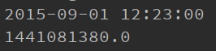

​		*注意Python的timestamp是一个浮点数。如果有小数位，小数位表示毫秒数。*

​		

​		**timestamp转换为datetime**

​		要把timestamp转换为`datetime`，使用`datetime`提供的`fromtimestamp()`方法：

```
from datetime import datetime
t = 1429417200.0
print(datetime.fromtimestamp(t))
```

​		*注意到timestamp是一个浮点数，它没有时区的概念，而datetime是有时区的。上述转换是在timestamp和本地时间做转换*。

​		本地时间是指当前操作系统设定的时区。


------------------------------

#### 4.4  str与datetime转换

​		**str转换为datetime**

​		转换方法是通过`datetime.strptime()`实现，需要一个日期和时间的格式化字符串：

```
>>> from datetime import datetime
>>> cday = datetime.strptime('2015-6-1 18:19:59', '%Y-%m-%d %H:%M:%S')
>>> print(cday)
2015-06-01 18:19:59
```

​		注意转换后的datetime是没有时区信息的。


​		**datetime转换为str**

​		如果已经有了datetime对象，要把它格式化为字符串显示给用户，就需要转换为str，转换方法是通过`strftime()`实现的，同样需要一个日期和时间的格式化字符串：

```
>>> from datetime import datetime
>>> now = datetime.now()
>>> print(now.strftime('%a, %b %d %H:%M'))
Mon, May 05 16:28
```


------------------------------------------------------------------

#### 4.5  datetime加减

​		对日期和时间进行加减实际上就是把datetime往后或往前计算，得到新的datetime。加减可以直接用`+`和`-`运算符，不过需要导入`timedelta`这个类：

```
>>> from datetime import datetime, timedelta
>>> now = datetime.now()
>>> now
datetime.datetime(2015, 5, 18, 16, 57, 3, 540997)
>>> now + timedelta(hours=10)
datetime.datetime(2015, 5, 19, 2, 57, 3, 540997)
>>> now - timedelta(days=1)
datetime.datetime(2015, 5, 17, 16, 57, 3, 540997)
>>> now + timedelta(days=2, hours=12)
datetime.datetime(2015, 5, 21, 4, 57, 3, 540997)
```


------------------------------------------------------

#### 4.6  本地时间转换为UTC时间

​		本地时间是指系统设定时区的时间，例如北京时间是UTC+8:00时区的时间，而UTC时间指UTC+0:00时区的时间。

​		一个`datetime`类型有一个时区属性`tzinfo`，但是默认为`None`，所以无法区分这个`datetime`到底是哪个时区，除非强行给`datetime`设置一个时区。


------------------------

#### 4.7  时区转换

​		通过`utcnow()`拿到当前的UTC时间，再转换为任意时区的时间：

```
# 拿到UTC时间，并强制设置时区为UTC+0:00:
>>> utc_dt = datetime.utcnow().replace(tzinfo=timezone.utc)
>>> print(utc_dt)
2015-05-18 09:05:12.377316+00:00
# astimezone()将转换时区为北京时间:
>>> bj_dt = utc_dt.astimezone(timezone(timedelta(hours=8)))
>>> print(bj_dt)
2015-05-18 17:05:12.377316+08:00
# astimezone()将转换时区为东京时间:
>>> tokyo_dt = utc_dt.astimezone(timezone(timedelta(hours=9)))
>>> print(tokyo_dt)
2015-05-18 18:05:12.377316+09:00
# astimezone()将bj_dt转换时区为东京时间:
>>> tokyo_dt2 = bj_dt.astimezone(timezone(timedelta(hours=9)))
>>> print(tokyo_dt2)
2015-05-18 18:05:12.377316+09:00
```

​		时区转换的关键在于，拿到一个`datetime`时，要获知其正确的时区，然后强制设置时区，作为基准时间。

​		利用带时区的`datetime`，通过`astimezone()`方法，可以转换到任意时区。

​		注：不是必须从UTC+0:00时区转换到其他时区，任何带时区的`datetime`都可以正确转换，例如上述`bj_dt`到`tokyo_dt`的转换。


​		**小结：**

​		`datetime`表示的时间需要时区信息才能确定一个特定的时间，否则只能视为本地时间。

​		如果要存储`datetime`，最佳方法是将其转换为timestamp再存储，因为timestamp的值与时区完全无关。


5  常用Python

## 5  常用Python标准库函数

#### 5.1  math库

​		import math导入库

​		help(math.ceil)查看帮助文档

​		ceil——向上取整

​		floor——向下取整

​		pow——幂次方

​		sqrt——开方

​		degrees——弧度转换成角度

​		radians——角度转换成弧度


------------------

#### 5.2  OS库

​		import os导入库

​		os.getcwd()——获取当前的工作目录；

​		os.chdir(path)——设置path路径字符串，改变工作目录路径；

​		os.rename(‘test.txt’,‘test1.txt’)——重命名；

​		os.remove(‘test1.txt’)——删除文件；

​		

------------------------

#### 5.3  random库

​		import random导入库

​		random.choice()——选择；

​		random.randint(1,100)——生成一个1到100之间的随机整数；

​		random.randrange(0,10,2)——生成一个随机整数；

​		random.random()——生成一个0到1.0（不包含）之间的随机浮点数；

​		random.uniform(5,10)——生成5到10之间的一个随机浮点数；

​		random.sample(range(100),10)——在生成的随机数中，取10个；

​		random.shuffle(list)——用于将列表中元素的顺序打乱；


------

#### 5.4  datetime库

​		from datetime import date导入date模块

​		date.today()——今天的日期；

​		from datetime import time导入time模块

​		tm=time(23,22,43)——创建时间23：22：43；

​		from datetime import datetime导入datetime模块

​		dt=datetime.now()

​		dt.strftime(‘%a,%b %d %Y %H:%M’)——转换成常见格式

​		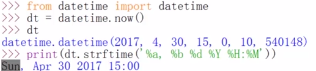

​		timestamp()——时间戳；

​		datetime.fromtimestamp()——转换成本地时间；


## 6  异常

#### 6.1 常见异常

​		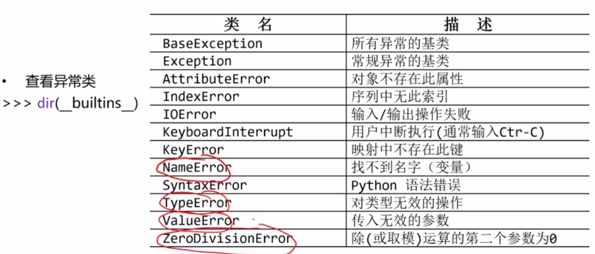

​		异常处理：

​		try-except——对异常进行捕捉处理；

​		使用方式：

​		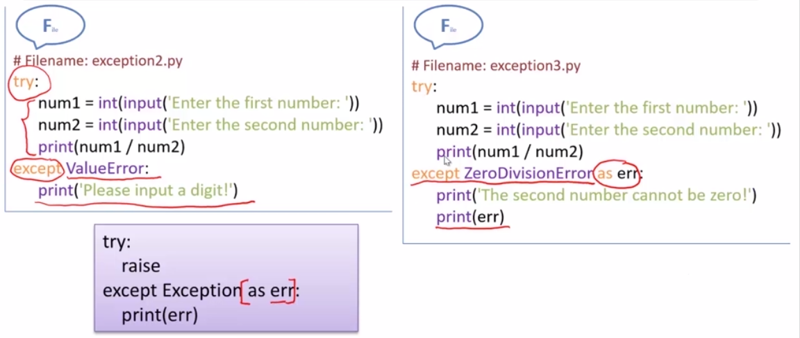

​		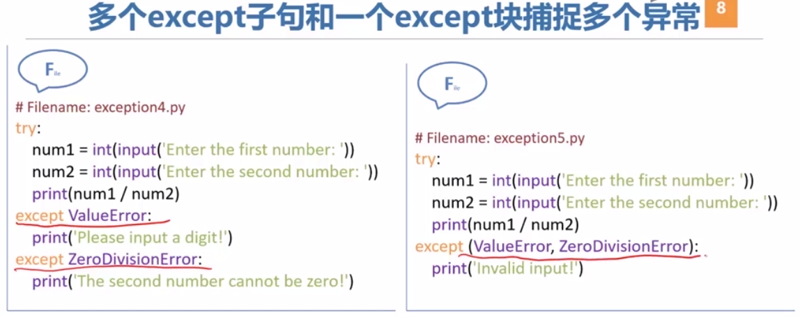

​		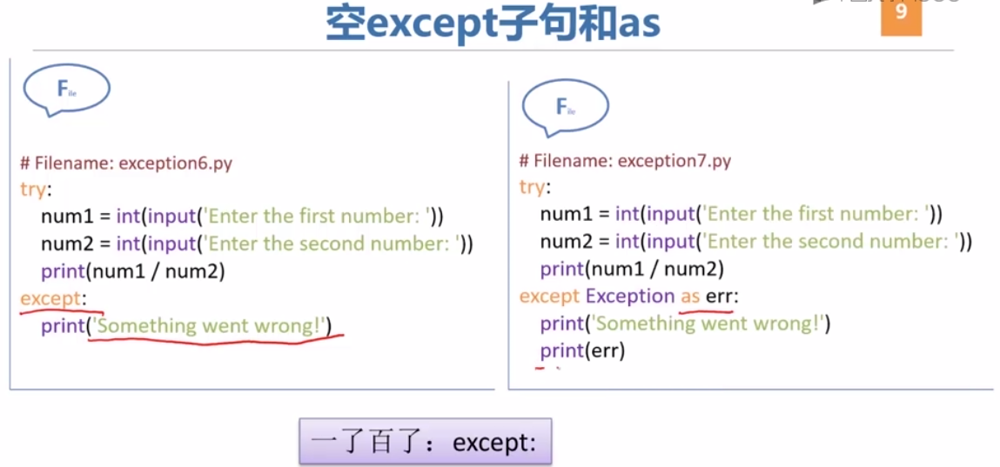

​		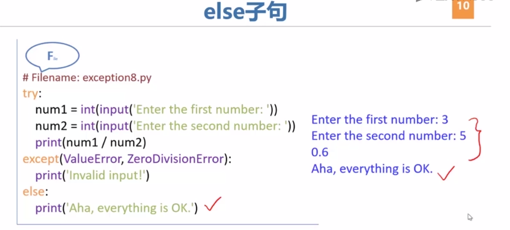

​		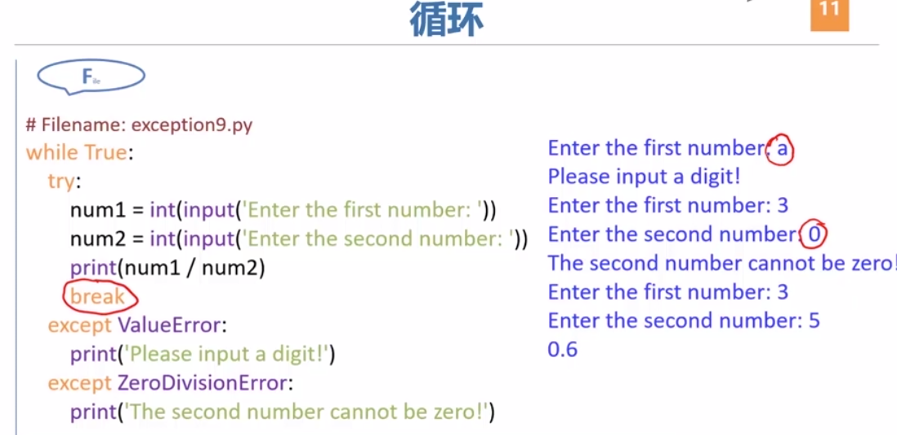

​		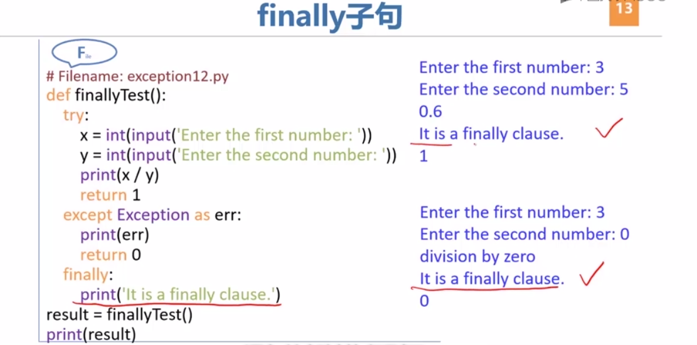

​		finally子句不管是否发生异常，都会执行。

​		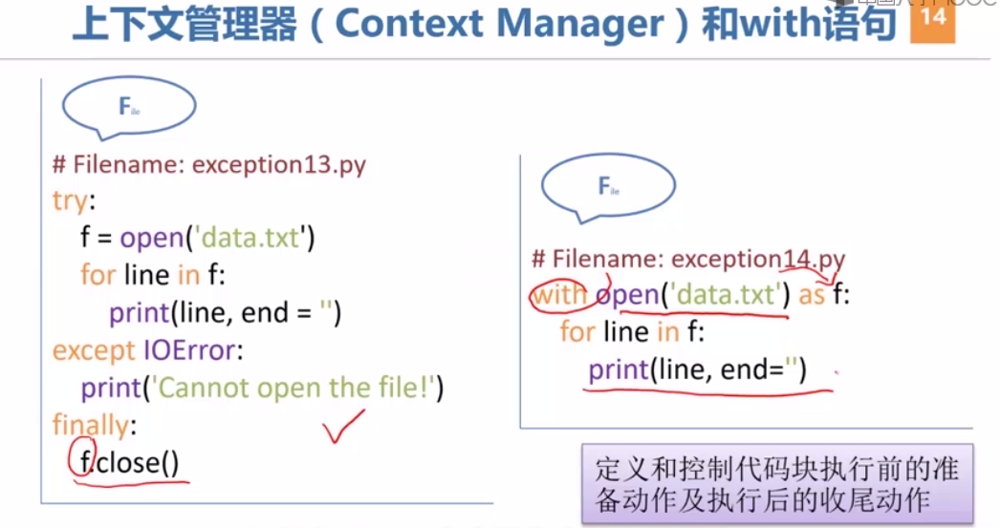


