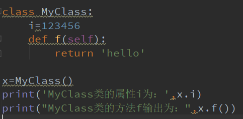
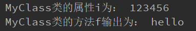
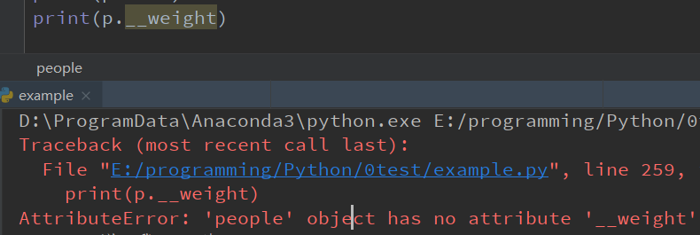
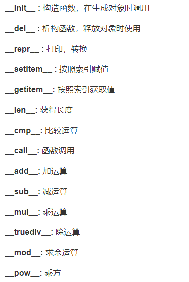

## Task5

## 1 类和对象

#### 1.1  面向对象	

- **类(Class):** 用来描述具有相同的属性和方法的对象的集合。它定义了该集合中每个对象所共有的属性和方法。对象是类的实例。

- **方法：**类中定义的函数。

- **类变量：**类变量在整个实例化的对象中是公用的。类变量定义在类中且在函数体之外。类变量通常不作为实例变量使用。

- **数据成员：**类变量或者实例变量用于处理类及其实例对象的相关的数据。

- **方法重写：**如果从父类继承的方法不能满足子类的需求，可以对其进行改写，这个过程叫方法的覆盖（override），也称为方法的重写。

- **局部变量：**定义在方法中的变量，只作用于当前实例的类。

- **实例变量：**在类的声明中，属性是用变量来表示的。这种变量就称为实例变量，是在类声明的内部但是在类的其他成员方法之外声明的。

- **继承：**即一个派生类（derived class）继承基类（base class）的字段和方法。继承也允许把一个派生类的对象作为一个基类对象对待。例如，有这样一个设计：一个Dog类型的对象派生自Animal类，这是模拟"是一个（is-a）"关系（例图，Dog是一个Animal）。

- **实例化：**创建一个类的实例，类的具体对象。

- **对象：**通过类定义的数据结构实例。对象包括两个数据成员（类变量和实例变量）和方法。

  和其它编程语言相比，Python 在尽可能不增加新的语法和语义的情况下加入了类机制。

  Python中的类提供了面向对象编程的所有基本功能：类的继承机制允许多个基类，派生类可以覆盖基类中的任何方法，方法中可以调用基类中的同名方法。

  对象可以包含任意数量和类型的数据。


------------------------------------------------------------------

#### 1.2 类定义

​		语法格式：

```
class ClassName:
    <statement-1>
    .
    .
    .
    <statement-N>
```


------------------------------------------------------------------------------------

#### 1.3  类对象

​		类对象支持两种操作：属性引用和实例化。

​		属性引用使用和python中所有的属性引用一样的标准语法：**obj.name**。

​		类对象创建后，类命名空间中所有的命名都是有效属性名。

​		例如：

​		

​		输出结果：

​		

​		

​		类有一个名为\__init__()的特殊方法（构造方法），该方法在类实例化时会自动调用，例如：

```
def __init__(self):
    self.data = []
```

​		类定义了 `__init__() `方法，类的实例化操作会自动调用 `__init__() `方法。（即，类似于初始化设置）

​		当然， `__init__() `方法可以有参数，参数通过`__init__() `传递到类的实例化操作上。

​		***构造方法中的初始值无法继承。***


​		**self代表类的实例，而非类**

​		类的方法与普通的函数只有一个特别的区别——它们必须有一个额外的**第一个参数名称**, 按照惯例它的名称是 self。

```
class Test:
    def prt(self):
        print(self)
        print(self.__class__)
 
t = Test()
t.prt()
```

​		输出结果：

```
<__main__.Test instance at 0x100771878>
__main__.Test
```

​		从执行结果可以很明显的看出，self 代表的是类的实例，代表当前对象的地址，而 self.class 则指向类。

​		self 不是 python 关键字，我们把他换成 runoob 也是可以正常执行的:

```
class Test:
    def prt(runoob):
        print(runoob)
        print(runoob.__class__)
 
t = Test()
t.prt()
```


------------------------------

#### 1.4  类的方法

​		在类的内部，使用`def `关键字来定义一个方法，与一般函数定义不同，类方法必须包含参数 `self`, 且为第一个参数，`self` 代表的是类的实例。

```
#类定义
class people:
    #定义基本属性
    name = ''
    age = 0
    #定义私有属性,私有属性在类外部无法直接进行访问
    __weight = 0
    #定义构造方法
    def __init__(self,n,a,w):
        self.name = n
        self.age = a
        self.__weight = w
    def speak(self):
        print("%s 说: 我 %d 岁。" %(self.name,self.age))
 
# 实例化类
p = people('runoob',10,30)
p.speak()
```

​		输出结果：

```
runoob 说: 我 10 岁。
```

​		注意：私有属性无法在类外部直接访问；

​		


------------------------------------------

#### 1.5  继承

​		派生类语法如下：

```
class DerivedClassName(BaseClassName1):
    <statement-1>
    .
    .
    .
    <statement-N>
```

​		需要注意圆括号中基类的顺序，若是基类中有相同的方法名，而在子类使用时未指定，python从左至右搜索 即方法在子类中未找到时，从左到右查找基类中是否包含方法。

​		BaseClassName（示例中的基类名）必须与派生类定义在一个作用域内。除了类，还可以用表达式，基类定义在另一个模块中时这一点非常有用:

```
class DerivedClassName(modname.BaseClassName):
```

​		例如：

```
#类定义
class people:
    #定义基本属性
    name = ''
    age = 0
    #定义私有属性,私有属性在类外部无法直接进行访问
    __weight = 0
    #定义构造方法
    def __init__(self,n,a,w):
        self.name = n
        self.age = a
        self.__weight = w
    def speak(self):
        print("%s 说: 我 %d 岁。" %(self.name,self.age))
 
#单继承示例
class student(people):
    grade = ''
    def __init__(self,n,a,w,g):
        #调用父类的构函
        people.__init__(self,n,a,w)
        self.grade = g
    #覆写父类的方法
    def speak(self):
        print("%s 说: 我 %d 岁了，我在读 %d 年级"%(self.name,self.age,self.grade))
 
 
 
s = student('ken',10,60,3)
s.speak()
```

​		输出结果：

```
ken 说: 我 10 岁了，我在读 3 年级
```


------------

#### 1.6  多继承

​		语法格式如下：

```
class DerivedClassName(Base1, Base2, Base3):
    <statement-1>
    .
    .
    .
    <statement-N>
```

​		需要注意圆括号中父类的顺序，若是父类中有相同的方法名，而在子类使用时未指定，python从左至右搜索 即方法在子类中未找到时，从左到右查找父类中是否包含方法。

```
#类定义
class people:
    #定义基本属性
    name = ''
    age = 0
    #定义私有属性,私有属性在类外部无法直接进行访问
    __weight = 0
    #定义构造方法
    def __init__(self,n,a,w):
        self.name = n
        self.age = a
        self.__weight = w
    def speak(self):
        print("%s 说: 我 %d 岁。" %(self.name,self.age))
 
#单继承示例
class student(people):
    grade = ''
    def __init__(self,n,a,w,g):
        #调用父类的构函
        people.__init__(self,n,a,w)
        self.grade = g
    #覆写父类的方法
    def speak(self):
        print("%s 说: 我 %d 岁了，我在读 %d 年级"%(self.name,self.age,self.grade))
 
#另一个类，多重继承之前的准备
class speaker():
    topic = ''
    name = ''
    def __init__(self,n,t):
        self.name = n
        self.topic = t
    def speak(self):
        print("我叫 %s，我是一个演说家，我演讲的主题是 %s"%(self.name,self.topic))
 
#多重继承
class sample(speaker,student):
    a =''
    def __init__(self,n,a,w,g,t):
        student.__init__(self,n,a,w,g)
        speaker.__init__(self,n,t)
 
test = sample("Tim",25,80,4,"Python")
test.speak()   #方法名同，默认调用的是在括号中排前地父类的方法
```

​		输出结果：

```
我叫 Tim，我是一个演说家，我演讲的主题是 Python
```


------------------------------------------------------------------

#### 1.7  方法重写

​		如果你的父类方法的功能不能满足你的需求，你可以在子类重写你父类的方法。

```
class Parent:        # 定义父类
   def myMethod(self):
      print ('调用父类方法')
 
class Child(Parent): # 定义子类
   def myMethod(self):
      print ('调用子类方法')
 
c = Child()          # 子类实例
c.myMethod()         # 子类调用重写方法
super(Child,c).myMethod() #用子类对象调用父类已被覆盖的方法
```

​		

​		[super() 函数](https://www.runoob.com/python/python-func-super.html)是用于调用父类(超类)的一个方法。

​		**super()函数**是用来解决多继承问题的，直接用类名调用父类在使用多继承时，会涉及到查找顺序（MRO）、重复调用（钻石继承）等问题。

​		MRO就是**类的方法解析顺序表**，其实就是继承父类方法时的顺序表。

​		语法格式：

```
super(type[, object-or-type])
```

​		

------------------------------------------------------------------------

#### 1.8  类属性与方法

​		**类的私有属性**

​		**__private_attrs**：两个下划线开头，声明该属性为私有，不能在类的外部被使用或直接访问。

​		在类内部的方法中使用时 **self.__private_attrs**。


​		**类的方法**

​		在类的内部，使用 def 关键字来定义一个方法，与一般函数定义不同，类方法必须包含参数 **self**，且为第一个参数，**self** 代表的是类的实例。

​		**self** 的名字并不是规定死的，也可以使用 **this**，但是最好还是按照约定是用 **self**。


​		**类的私有方法**
​		\__private_method：两个下划线开头，声明该方法为私有方法，只能在类的内部调用 ，不能在类的外部调用。self.__private_methods。

```
class Site:
    def __init__(self, name, url):
        self.name = name       # public
        self.__url = url   # private
 
    def who(self):
        print('name  : ', self.name)
        print('url : ', self.__url)
 
    def __foo(self):          # 私有方法
        print('这是私有方法')
 
    def foo(self):            # 公共方法
        print('这是公共方法')
        self.__foo()
 
x = Site('菜鸟教程', 'www.runoob.com')
x.who()        # 正常输出
x.foo()        # 正常输出
x.__foo()      # 报错
```

​		

​		 **类的专有方法：**

​		


------------------------------------------------------------

#### 1.9  运算重载

​		以对类的专有方法进行重载。

```
class Vector:
   def __init__(self, a, b):
      self.a = a
      self.b = b
 
   def __str__(self):
      return 'Vector (%d, %d)' % (self.a, self.b)
   
   def __add__(self,other):
      return Vector(self.a + other.a, self.b + other.b)
 
v1 = Vector(2,10)
v2 = Vector(5,-2)
print (v1 + v2)
```

​		输出结果：

```
Vector(7,8)
```


------------------------------------------------------------------------------------

#### 1.10  Python子类继承父类构造函数的说明

​		如果在子类中需要父类的构造方法就需要显式地调用父类的构造方法，或者不重写父类的构造方法。

​		**第一种情况：**

​		子类不重写 `__init__`，实例化子类时，会自动调用父类定义的 `__init__`。

​		例如：

```
class Father(object):
    def __init__(self, name):
        self.name=name
        print ( "name: %s" %( self.name) )
    def getName(self):
        return 'Father ' + self.name
 
class Son(Father):
    def getName(self):
        return 'Son '+self.name
 
if __name__=='__main__':
    son=Son('runoob')	#这里因为子类没有构造函数，所以直接调用的父类的构造函数
    print ( son.getName() )#调用子类的方法
```

​		输出结果：

```
name: runoob
Son runoob
```

​		

​		**第二种情况：**

​		如果重写了`__init__` 时，实例化子类，就不会调用父类已经定义的`__init__`，例如：

```
class Father(object):
    def __init__(self, name):   #父类构造函数
        self.name=name
        print ( "name: %s" %( self.name) )
    def getName(self):
        return 'Father ' + self.name
 
class Son(Father):
    def __init__(self, name):		#子类构造函数
        print ( "hi" )
        self.name =  name
    def getName(self):
        return 'Son '+self.name
 
if __name__=='__main__':
    son=Son('runoob')
    print ( son.getName() )
```

​		输出结果：

```
hi
Son runoob
```

​		

​		如果重写了`__init__ `时，要继承父类的构造方法，可以使用 **super** 关键字：

```
super(子类，self).__init__(参数1，参数2，....)
```

​		还有一种经典写法：

```
父类名称.__init__(self,参数1，参数2，...)
```

​		例如：

```
class Father(object):
    def __init__(self, name):
        self.name=name
        print ( "name: %s" %( self.name))
    def getName(self):
        return 'Father ' + self.name
 
class Son(Father):
    def __init__(self, name):
        super(Son, self).__init__(name)  #继承父类的构造方法，可以替换成Father.__init__(self,name)
        print ("hi")
        self.name =  name
    def getName(self):
        return 'Son '+self.name
 
if __name__=='__main__':
    son=Son('runoob')
    print ( son.getName() )
```

​		输出结果：

```
name: runoob
hi
Son runoob
```


​		**关于**`__name__`

​		首先需要了解` __name__ `是属于 python 中的内置类属性，就是它会天生就存在与一个 python 程序中，代表对应程序名称。		比如所示的一段代码里面（这个脚本命名为 pcRequests.py），我只设了一个函数，但是并没有地方运行它，所以当 run 了这一段代码之后我们有会发现这个函数并没有被调用。但是当我们在运行这个代码时这个代码的 `__name__ `的值为 `__main__ `（一段程序作为主线运行程序时其内置名称就是` __main__`）。

```
import requests
class requests(object):
    def __init__(self,url):
        self.url=url
        self.result=self.getHTMLText(self.url)
    def getHTMLText(url):
        try:
            r=requests.get(url,timeout=30)
            r.raise_for_status()
            r.encoding=r.apparent_encoding
            return r.text
        except:
            return "This is a error."
print(__name__)
```


## 2  正则表达式

#### 2.1  正则表达式

​		正则表达式(Regular Expression)是一种文本模式，包括普通字符（例如，a 到 z 之间的字母）和特殊字符（称为"元字符"）。

​		正则表达式使用单个字符串来描述、匹配一系列匹配某个句法规则的字符串。

​		

​		正则表达式示例：

​		

- **^** 为匹配输入字符串的开始位置。
- **[0-9]+**匹配多个数字， **[0-9]** 匹配单个数字，**+** 匹配一个或者多个。
- **abc$**匹配字母 **abc** 并以 **abc** 结尾，**$** 为匹配输入字符串的结束位置。


​		只允许用户名包含字符、数字、下划线和连接字符（-），并设置用户名的长度，就可以使用以下正则表达式来设定。

​		

​		*注意：小于3个无法匹配。*

​		

​		使用正则表达式，可以：

- 测试字符串内的模式；
- 替换文本；
- 基于模匹配从字符串中提取子字符串。

​		

------------------------------------------------------------

#### 2.2  语法

​		正则表达式描述了一种字符串匹配的模式，可以用来检查一个串是否含有某种子串、将匹配的子串替换或者从某个串中取出符合某个条件的子串等。

​		正则表达式是由普通字符（例如字符 a 到 z）以及特殊字符（称为"元字符"）组成的文字模式。

​		**普通字符：**

​		普通字符包括没有显式指定为元字符的所有可打印和不可打印字符。这包括所有大写和小写字母、所有数字、所有标点符号和一些其他符号。

​		**非打印字符：**

​		非打印字符也可以是正则表达式的组成部分。下表是表示非打印字符的转义序列：

| 字符 | 描述                                                         |
| :--: | ------------------------------------------------------------ |
| \cx  | 匹配由x指明的控制字符。例如， \cM 匹配一个 Control-M 或回车符。x 的值必须为 A-Z 或 a-z 之一。否则，将 c 视为一个原义的 'c' 字符。 |
|  \f  | 匹配一个换页符。等价于 \x0c 和 \cL。                         |
|  \n  | 匹配一个换行符。等价于 \x0a 和 \cJ。                         |
|  \r  | 匹配一个回车符。等价于 \x0d 和 \cM。                         |
|  \s  | 匹配任何空白字符，包括空格、制表符、换页符等等。等价于 [ \f\n\r\t\v]。注意 Unicode 正则表达式会匹配全角空格符。 |
|  \S  | 匹配任何非空白字符。等价于 [^ \f\n\r\t\v]。                  |
|  \t  | 匹配一个制表符。等价于 \x09 和 \cI。                         |
|  \v  | 匹配一个垂直制表符。等价于 \x0b 和 \cK。                     |

​		**特殊字符：**

​		即一些有特殊含义的字符，如runoo*b的\*表示任何字符串的意思。如果要查找\*号，则需要对其进行转义，即使用一个反斜杠。

​		许多元字符要求在试图匹配它们时特别对待。若要匹配这些特殊字符，必须首先使字符"转义"，即，将反斜杠字符**\** 放在它们前面。下表列出了正则表达式中的特殊字符：

| 特别字符 | 描述                                                         |
| :------- | :----------------------------------------------------------- |
| $        | 匹配输入字符串的结尾位置。如果设置了 RegExp 对象的 Multiline 属性，则 $ 也匹配 '\n' 或 '\r'。要匹配 $ 字符本身，请使用 \$。 |
| ( )      | 标记一个子表达式的开始和结束位置。子表达式可以获取供以后使用。要匹配这些字符，请使用 \( 和 \)。 |
| *        | 匹配前面的子表达式零次或多次。要匹配 * 字符，请使用 \*。     |
| +        | 匹配前面的子表达式一次或多次。要匹配 + 字符，请使用 \+。     |
| .        | 匹配除换行符 \n 之外的任何单字符。要匹配 . ，请使用 \. 。    |
| [        | 标记一个中括号表达式的开始。要匹配 [，请使用 \[。            |
| ?        | 匹配前面的子表达式零次或一次，或指明一个非贪婪限定符。要匹配 ? 字符，请使用 \?。 |
| \        | 将下一个字符标记为或特殊字符、或原义字符、或向后引用、或八进制转义符。例如， 'n' 匹配字符 'n'。'\n' 匹配换行符。序列 '\\' 匹配 "\"，而 '\(' 则匹配 "("。 |
| ^        | 匹配输入字符串的开始位置，除非在方括号表达式中使用，此时它表示不接受该字符集合。要匹配 ^ 字符本身，请使用 \^。 |
| {        | 标记限定符表达式的开始。要匹配 {，请使用 \{。                |
| \|       | 指明两项之间的一个选择。要匹配 \|，请使用 \|。               |

​		**限定符：**

​		限定符用来指定正则表达式的一个给定组件必须要出现多少次才能满足匹配。有 ***** 或 **+** 或 **?** 或 **{n}** 或 **{n,}** 或 **{n,m}** 共6种。正则表达式的限定符有：

| 字符  | 描述                                                         |
| :---- | :----------------------------------------------------------- |
| *     | 匹配前面的子表达式零次或多次。例如，zo* 能匹配 "z" 以及 "zoo"。* 等价于{0,}。 |
| +     | 匹配前面的子表达式一次或多次。例如，'zo+' 能匹配 "zo" 以及 "zoo"，但不能匹配 "z"。+ 等价于 {1,}。 |
| ?     | 匹配前面的子表达式零次或一次。例如，"do(es)?" 可以匹配 "do" 、 "does" 中的 "does" 、 "doxy" 中的 "do" 。? 等价于 {0,1}。 |
| {n}   | n 是一个非负整数。匹配确定的 n 次。例如，'o{2}' 不能匹配 "Bob" 中的 'o'，但是能匹配 "food" 中的两个 o。 |
| {n,}  | n 是一个非负整数。至少匹配n 次。例如，'o{2,}' 不能匹配 "Bob" 中的 'o'，但能匹配 "foooood" 中的所有 o。'o{1,}' 等价于 'o+'。'o{0,}' 则等价于 'o*'。 |
| {n,m} | m 和 n 均为非负整数，其中n <= m。最少匹配 n 次且最多匹配 m 次。例如，"o{1,3}" 将匹配 "fooooood" 中的前三个 o。'o{0,1}' 等价于 'o?'。请注意在逗号和两个数之间不能有空格。 |

​		***、+限定符都是贪婪的，因为它们会尽可能多的匹配文字，只有在它们的后面加上一个?就可以实现非贪婪或最小匹配。**

​		**定位符：**

​		定位符使您能够将正则表达式固定到行首或行尾。它们还使您能够创建这样的正则表达式，这些正则表达式出现在一个单词内、在一个单词的开头或者一个单词的结尾。

​		定位符用来描述字符串或单词的边界，**^** 和 **$** 分别指字符串的开始与结束，**\b** 描述单词的前或后边界，**\B** 表示非单词边界。

​		正则表达式的定位符有：

| 字符 | 描述                                                         |
| :--- | :----------------------------------------------------------- |
| ^    | 匹配输入字符串开始的位置。如果设置了 RegExp 对象的 Multiline 属性，^ 还会与 \n 或 \r 之后的位置匹配。 |
| $    | 匹配输入字符串结尾的位置。如果设置了 RegExp 对象的 Multiline 属性，$ 还会与 \n 或 \r 之前的位置匹配。 |
| \b   | 匹配一个单词边界，即字与空格间的位置。                       |
| \B   | 非单词边界匹配。                                             |

​		**选择：**

​		用圆括号将所有选择项括起来，相邻的选择项之间用|分隔。但用圆括号会有一个副作用，使相关的匹配会被缓存，此时可用?:放在第一个选项前来消除这种副作用。

​		其中 **?:** 是非捕获元之一，还有两个非捕获元是 **?=** 和 **?!**，这两个还有更多的含义，前者为正向预查，在任何开始匹配圆括号内的正则表达式模式的位置来匹配搜索字符串，后者为负向预查，在任何开始不匹配该正则表达式模式的位置来匹配搜索字符串。

​		**反向引用：**

​		对一个正则表达式模式或部分模式两边添加圆括号将导致相关匹配存储到一个临时缓冲区中，所捕获的每个子匹配都按照在正则表达式模式中从左到右出现的顺序存储。缓冲区编号从 1 开始，最多可存储 99 个捕获的子表达式。每个缓冲区都可以使用 **\n** 访问，其中 n 为一个标识特定缓冲区的一位或两位十进制数。

​		可以使用非捕获元字符 **?:**、**?=** 或 **?!** 来重写捕获，忽略对相关匹配的保存。

​		反向引用的最简单的、最有用的应用之一，是提供查找文本中两个相同的相邻单词的匹配项的能力。


------------------------------------

#### 2.3  Python正则表达式（re模块）

###### 		1）re.match函数

​		该函数从字符串的起始位置匹配一个模式，匹配成功返回一个匹配的对象。如果不是起始位置匹配成功的话，就返回一个none。

​		语法格式：

```
re.match(pattern, string, flags=0)
```

| 参数    | 描述                                                         |
| :------ | :----------------------------------------------------------- |
| pattern | 匹配的正则表达式                                             |
| string  | 要匹配的字符串。                                             |
| flags   | 标志位，用于控制正则表达式的匹配方式，如：是否区分大小写，多行匹配等等。参见：[正则表达式修饰符 - 可选标志](https://www.runoob.com/python3/python3-reg-expressions.html#flags) |

​		可以使用group(num)或者groups()匹配对象函数来获取匹配表达式。

| 匹配对象方法 | 描述                                                         |
| :----------- | :----------------------------------------------------------- |
| group(num=0) | 匹配的整个表达式的字符串，group() 可以一次输入多个组号，在这种情况下它将返回一个包含那些组所对应值的元组。 |
| groups()     | 返回一个包含所有小组字符串的元组，从 1 到 所含的小组号。     |

​		例如：

```
import re
 
line = "Cats are smarter than dogs"
# .* 表示任意匹配除换行符（\n、\r）之外的任何单个或多个字符
matchObj = re.match( r'(.*) are (.*?) .*', line, re.M|re.I)
 
if matchObj:
   print ("matchObj.group() : ", matchObj.group())
   print ("matchObj.group(1) : ", matchObj.group(1))
   print ("matchObj.group(2) : ", matchObj.group(2))
else:
   print ("No match!!")
```

​		输出结果：

```
matchObj.group() :  Cats are smarter than dogs
matchObj.group(1) :  Cats
matchObj.group(2) :  smarter
```

​		

------------------------

###### 		2）re.search方法

​		扫描整个字符串并返回第一个成功的匹配。

​		语法格式：

```
re.search(pattern, string, flags=0)
```

| 参数    | 描述                                                         |
| :------ | :----------------------------------------------------------- |
| pattern | 匹配的正则表达式                                             |
| string  | 要匹配的字符串。                                             |
| flags   | 标志位，用于控制正则表达式的匹配方式，如：是否区分大小写，多行匹配等等。参见：[正则表达式修饰符 - 可选标志](https://www.runoob.com/python3/python3-reg-expressions.html#flags) |

​		匹配成功re.search方法返回一个匹配的对象，否则返回None。

​		可以使用group(num) 或 groups() 匹配对象函数来获取匹配表达式。

| 匹配对象方法 | 描述                                                         |
| :----------- | :----------------------------------------------------------- |
| group(num=0) | 匹配的整个表达式的字符串，group() 可以一次输入多个组号，在这种情况下它将返回一个包含那些组所对应值的元组。 |
| groups()     | 返回一个包含所有小组字符串的元组，从 1 到 所含的小组号。     |

​		

------------------------------------------------

###### 		re.match与re.search的区别：

​		re.match只匹配字符串的开始，如果字符串开始不符合正则表达式，则匹配失败，函数返回None；而re.search匹配整个字符串，直到找到一个匹配。

​		例如：

```
import re
 
line = "Cats are smarter than dogs";
 
matchObj = re.match( r'dogs', line, re.M|re.I)
if matchObj:
   print ("match --> matchObj.group() : ", matchObj.group())
else:
   print ("No match!!")
 
matchObj = re.search( r'dogs', line, re.M|re.I)
if matchObj:
   print ("search --> matchObj.group() : ", matchObj.group())
else:
   print ("No match!!")
```

​		输出结果：

```
No match!!
search --> matchObj.group() :  dogs
```

​		

------------------------------

###### 		检索和替换

​		re模块提供了re.sub用于替换字符串中的匹配项。

​		语法格式：（前三个为必选参数，后两个为可选参数。）

```
re.sub(pattern, repl, string, count=0, flags=0)
```

​		参数：

- pattern : 正则中的模式字符串。
- repl : 替换的字符串，也可为一个函数。
- string : 要被查找替换的原始字符串。
- count : 模式匹配后替换的最大次数，默认 0 表示替换所有的匹配。
- flags : 编译时用的匹配模式，数字形式。


​		例如：

```
import re
 
phone = "2004-959-559 # 这是一个电话号码"
 
# 删除注释
num = re.sub(r'#.*$', "", phone)
print ("电话号码 : ", num)
 
# 移除非数字的内容
num = re.sub(r'\D', "", phone)
print ("电话号码 : ", num)
```

​		输出结果：

```
电话号码 :  2004-959-559 
电话号码 :  2004959559
```


------------------------------------------------------------

###### 		compile函数

​		compile 函数用于编译正则表达式，生成一个正则表达式（ Pattern ）对象，供 match() 和 search() 这两个函数使用。

​		语法格式：

```
re.compile(pattern[, flags])
```

​		参数：

- pattern : 一个字符串形式的正则表达式
- flags 可选，表示匹配模式，比如忽略大小写，多行模式等，具体参数为：
- - re.I 忽略大小写

  - re.L 表示特殊字符集 \w, \W, \b, \B, \s, \S 依赖于当前环境
  - re.M 多行模式
  - re.S 即为' . '并且包括换行符在内的任意字符（' . '不包括换行符）
  - re.U 表示特殊字符集 \w, \W, \b, \B, \d, \D, \s, \S 依赖于 Unicode 字符属性数据库
  - re.X 为了增加可读性，忽略空格和' # '后面的注释


​		当匹配成功时返回一个 Match 对象，其中：

- `group([group1, …])` 方法用于获得一个或多个分组匹配的字符串，当要获得整个匹配的子串时，可直接使用 `group()` 或 `group(0)`；
- `start([group])` 方法用于获取分组匹配的子串在整个字符串中的起始位置（子串第一个字符的索引），参数默认值为 0；
- `end([group])` 方法用于获取分组匹配的子串在整个字符串中的结束位置（子串最后一个字符的索引+1），参数默认值为 0；
- `span([group])` 方法返回 `(start(group), end(group))`。


------------------------------

###### 		findall

​		在字符串中找到正则表达式所匹配的所有子串，并返回一个列表，如果没有找到匹配的，则返回空列表。

​		**注意：** match 和 search 是匹配一次 findall 匹配所有。

​		语法格式：

```
findall(string[, pos[, endpos]])
```

​		参数：

- **string** 待匹配的字符串。
- **pos** 可选参数，指定字符串的起始位置，默认为 0。
- **endpos** 可选参数，指定字符串的结束位置，默认为字符串的长度。


------------------------------------

###### 		re.finditer

​		和 findall 类似，在字符串中找到正则表达式所匹配的所有子串，并把它们作为一个迭代器返回。

​		语法格式：

```
re.finditer(pattern, string, flags=0)
```

| 参数    | 描述                                                         |
| :------ | :----------------------------------------------------------- |
| pattern | 匹配的正则表达式                                             |
| string  | 要匹配的字符串。                                             |
| flags   | 标志位，用于控制正则表达式的匹配方式，如：是否区分大小写，多行匹配等等。参见：[正则表达式修饰符 - 可选标志](https://www.runoob.com/python3/python3-reg-expressions.html#flags) |

​		

------------------------------

###### 		re.split

​		split 方法按照能够匹配的子串将字符串分割后返回列表，它的使用形式如下：

```
re.split(pattern, string[, maxsplit=0, flags=0])
```

| 参数     | 描述                                                         |
| :------- | :----------------------------------------------------------- |
| pattern  | 匹配的正则表达式                                             |
| string   | 要匹配的字符串。                                             |
| maxsplit | 分隔次数，maxsplit=1 分隔一次，默认为 0，不限制次数。        |
| flags    | 标志位，用于控制正则表达式的匹配方式，如：是否区分大小写，多行匹配等等。参见：[正则表达式修饰符 - 可选标志](https://www.runoob.com/python3/python3-reg-expressions.html#flags) |


------------------------------------------------------------

#### 2.4  正则表达式对象

​		**re.RegexObject**
​		re.compile() 返回 RegexObject 对象。

​		**re.MatchObject**
​		group() 返回被 RE 匹配的字符串。

- start() 返回匹配开始的位置
- end() 返回匹配结束的位置
- span() 返回一个元组包含匹配 (开始,结束) 的位置


------

#### 2.5  正则表达式修饰符-可选标志

​			正则表达式可以包含一些可选标志修饰符来控制匹配的模式。修饰符被指定为一个可选的标志。多个标志可以通过按位 OR(|) 它们来指定。如 re.I | re.M 被设置成 I 和 M 标志：

| 修饰符 | 描述                                                         |
| :----- | :----------------------------------------------------------- |
| re.I   | 使匹配对大小写不敏感                                         |
| re.L   | 做本地化识别（locale-aware）匹配                             |
| re.M   | 多行匹配，影响 ^ 和 $                                        |
| re.S   | 使 . 匹配包括换行在内的所有字符                              |
| re.U   | 根据Unicode字符集解析字符。这个标志影响 \w, \W, \b, \B.      |
| re.X   | 该标志通过给予你更灵活的格式以便你将正则表达式写得更易于理解。 |

​		

------------------------------

#### 2.6  正则表达式模式

​		模式字符串使用特殊的语法来表示一个正则表达式：

​		字母和数字表示他们自身。一个正则表达式模式中的字母和数字匹配同样的字符串。

​		多数字母和数字前加一个反斜杠时会拥有不同的含义。

​		标点符号只有被转义时才匹配自身，否则它们表示特殊的含义。

​		反斜杠本身需要使用反斜杠转义。

​		由于正则表达式通常都包含反斜杠，所以你最好使用原始字符串来表示它们。模式元素(如 **r'\t'**，等价于 **\\t** )匹配相应的特殊字符。

​		下表列出了正则表达式模式语法中的特殊元素。如果你使用模式的同时提供了可选的标志参数，某些模式元素的含义会改变。

| 模式         | 描述                                                         |
| :----------- | :----------------------------------------------------------- |
| ^            | 匹配字符串的开头                                             |
| $            | 匹配字符串的末尾。                                           |
| .            | 匹配任意字符，除了换行符，当re.DOTALL标记被指定时，则可以匹配包括换行符的任意字符。 |
| [...]        | 用来表示一组字符,单独列出：[amk] 匹配 'a'，'m'或'k'          |
| [^...]       | 不在[]中的字符：[^abc] 匹配除了a,b,c之外的字符。             |
| re*          | 匹配0个或多个的表达式。                                      |
| re+          | 匹配1个或多个的表达式。                                      |
| re?          | 匹配0个或1个由前面的正则表达式定义的片段，非贪婪方式         |
| re{ n}       | 匹配n个前面表达式。例如，"o{2}"不能匹配"Bob"中的"o"，但是能匹配"food"中的两个o。 |
| re{ n,}      | 精确匹配n个前面表达式。例如，"o{2,}"不能匹配"Bob"中的"o"，但能匹配"foooood"中的所有o。"o{1,}"等价于"o+"。"o{0,}"则等价于"o*"。 |
| re{ n, m}    | 匹配 n 到 m 次由前面的正则表达式定义的片段，贪婪方式         |
| a\| b        | 匹配a或b                                                     |
| (re)         | 匹配括号内的表达式，也表示一个组                             |
| (?imx)       | 正则表达式包含三种可选标志：i, m, 或 x 。只影响括号中的区域。 |
| (?-imx)      | 正则表达式关闭 i, m, 或 x 可选标志。只影响括号中的区域。     |
| (?: re)      | 类似 (...), 但是不表示一个组                                 |
| (?imx: re)   | 在括号中使用i, m, 或 x 可选标志                              |
| (?-imx: re)  | 在括号中不使用i, m, 或 x 可选标志                            |
| (?#...)      | 注释.                                                        |
| (?= re)      | 前向肯定界定符。如果所含正则表达式，以 ... 表示，在当前位置成功匹配时成功，否则失败。但一旦所含表达式已经尝试，匹配引擎根本没有提高；模式的剩余部分还要尝试界定符的右边。 |
| (?! re)      | 前向否定界定符。与肯定界定符相反；当所含表达式不能在字符串当前位置匹配时成功。 |
| (?> re)      | 匹配的独立模式，省去回溯。                                   |
| \w           | 匹配数字字母下划线                                           |
| \W           | 匹配非数字字母下划线                                         |
| \s           | 匹配任意空白字符，等价于 [\t\n\r\f]。                        |
| \S           | 匹配任意非空字符                                             |
| \d           | 匹配任意数字，等价于 [0-9]。                                 |
| \D           | 匹配任意非数字                                               |
| \A           | 匹配字符串开始                                               |
| \Z           | 匹配字符串结束，如果是存在换行，只匹配到换行前的结束字符串。 |
| \z           | 匹配字符串结束                                               |
| \G           | 匹配最后匹配完成的位置。                                     |
| \b           | 匹配一个单词边界，也就是指单词和空格间的位置。例如， 'er\b' 可以匹配"never" 中的 'er'，但不能匹配 "verb" 中的 'er'。 |
| \B           | 匹配非单词边界。'er\B' 能匹配 "verb" 中的 'er'，但不能匹配 "never" 中的 'er'。 |
| \n, \t, 等。 | 匹配一个换行符。匹配一个制表符, 等                           |
| \1...\9      | 匹配第n个分组的内容。                                        |
| \10          | 匹配第n个分组的内容，如果它经匹配。否则指的是八进制字符码的表达式。 |