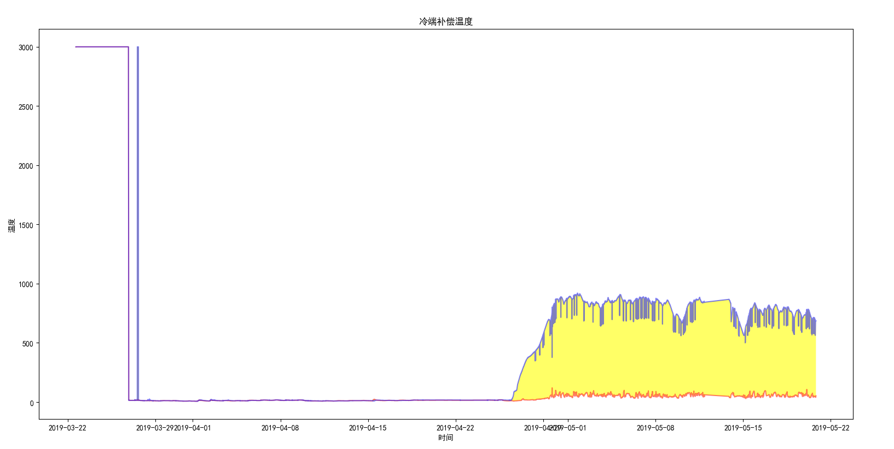

## CSV文件格式

#### 1  分析CSV文件头

​		模块csv的reader类包含next()方法，调用内置函数next()并将一个reader作为参数传递给它时，将调用reader的next()方法，从而返回文件中的下一行。


------------

#### 2  打印文件头及其位置

​		对列表调用enumerate()来获取每个元素的索引及其值。


------------

#### 3  提起并读取数据

```python
csvfile=open(r'C:\Users\ligang\Desktop\baogangGPS2.csv','r')
reader=csv.reader(csvfile)#reader对象
header_row=next(reader)#返回文件中的下一行
print(header_row)
for index,colum_header in enumerate(header_row):#获取每个元素的索引及其值
    print(index,colum_header)
temp0=[]
for row in reader:
    temp0.append(row[5])//获取第6列数据
print(temp0)
```

​		由于程序中已经读取了文件头行，所以最后一个循环将从第二行开始——从这行开始包含的是实际数据。

​		输出结果：

```python
['31.40', '31.40', '31.40', '31.40', '31.40', '31.40', '31.40', '31.40', '31.40', '31.40', '31.40', '31.40', '31.40', '31.40'......]
```


​		如果没有读取文件头行的程序，

```python
csvfile=open(r'C:\Users\ligang\Desktop\baogangGPS2.csv','r')
reader=csv.reader(csvfile)#reader对象
temp0=[]
for row in reader:
    temp0.append(row[1])
print(temp0)
```

​		则输出结果为

```python
['latitude', '31.40', '31.40', '31.40', '31.40', '31.40', '31.40', '31.40', '31.40', '31.40', '31.40', '31.40', '31.40'......]
```

​		可以发现，多了头行的内容。


------------------------

#### 4  字符串转换为数字

​		提取的数据是作为字符串存储在一个列表中的，可以使用int()将这些字符串转换为数字。

```python
temp1=[]
for row in reader:
    temp0=int(row[5])
    temp1.append(temp0)
```

​		输出结果：

```
[53, 48, 45, 44, 44, 44, 42, 41, 40, 40, 40, 41, 41, 43, 45, 45, 46, 46, 47, 48, 48, 50, 50, 50, 49, 48, 47, 46, 46, 45, 45.....]
```

​		

​		在实际工作中，原始数据的格式经常是不统一的，此类数值类型转换造成的ValueError异常。

​		原因在于：python不能直接将包含小数点的字符串转换为整数。为了消除这种错误，需要先将字符串转换为浮点数（float），再将浮点数转换为整数（int）。注意，这种方式会将小数点后的部分抹去，仅保留整数部分。


------------

#### 5  添加日期

​		当需要向图表中添加日期时，需要注意plot函数的参数，date需要放在第一位，否则绘制的结果不对。

```python
import csv
from matplotlib import pyplot as plt
import math
from datetime import datetime

plt.rcParams['font.sans-serif']=['SimHei']
plt.rcParams['axes.unicode_minus']=False

csvfile=open(r'C:\Users\ligang\Desktop\baogangGPS2.csv','r')
reader=csv.reader(csvfile)#reader对象
header_row=next(reader)#返回文件中的下一行
#print(header_row)
for index,colum_header in enumerate(header_row):#获取每个元素的索引及其值
    pass
    #print(index,colum_header)
date,temp1,temp2=[],[],[]#从文件中获取日期、温度
for row in reader:
    current_date=datetime.strptime(row[0],"%Y-%m-%d %H:%M:%S")#日期转换
    date.append(current_date)
    temp0 = int(row[5])
    temp1.append(temp0)
    temp0=int(row[9])
    temp2.append(temp0)
print(temp1,temp2)

plt.plot(date,temp1,c='red')
plt.plot(date,temp2,c='blue')
#设置图形的格式
plt.title('冷端补偿温度')
plt.xlabel('时间')
plt.ylabel('温度')
plt.show()
```

​		

------------------

#### 6  图标区域着色

​		方法fill_between()，接受一个x值系列和两个y值系列，填充两个y值系列之间的空间。

​			

```python
plt.plot(date,temp1,c='red',alpha=0.5)#alpha指定颜色的透明度，此处可将曲线的颜色变浅
plt.plot(date,temp2,c='blue',alpha=0.5)
plt.fill_between(date,temp1,temp2,facecolor='yellow',alpha=0.6)
```


