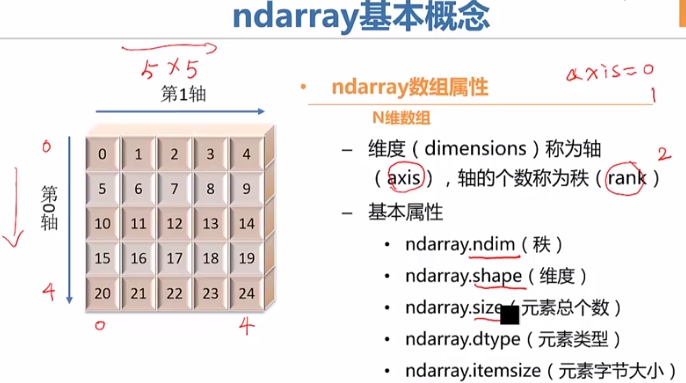
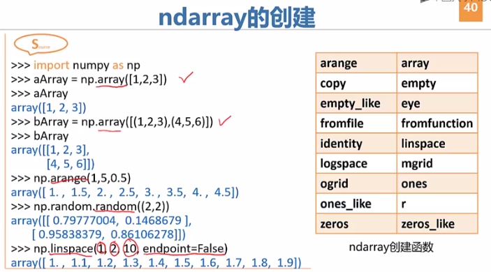

## Python库

#### 1  SciPy

​		

​		SciPy中的数据结构：

		- ndarray（n维数组）
		- Series（变长字典）
		- DataFrame（数据框）


​	**NumPy**：

​	

​	**SciPy核心库**：

​	

​	例如：

```
import numpy as np
from scipy import linalg
arr=np.array([[1,2],[3,4]])
linalg.det(arr)
```


​	**Matplotlib**:

​	

​	**pandas**:

​	


------------------

#### 2  ndarray

​		

​		

​	

​	

​	

​	**ndarray的操作**：

- .shape用来查看维度；
- .reshape用来改变维度。
- .resize也可以改变维度；注意上面的reshape不能改变原数组的维度，但是resize可以。
- .vstack()实现垂直方向上拼接；
- .hstack()实现水平方向上拼接。


​	**ndarray的运算**：

​	

​	利用基本数组统计方法：

​	

​		


​	**ndarray的ufunc函数**：

​	

​	

------------------------------

#### 3  变长字典Series

​		有序、定长的字典。

​		**基本特征**：

  - 类似一维数组的对象

  - 由数据和索引组成

    ​	

    第一列是索引，索引可以自定义：

    ​	

    可以查看索引和数据：

    ​	


​		**Series的数据对齐**：

​		

​		没有找到的数据，显示NaN表示Not a Number。

​		**重要功能1**：在算术运算中自动对齐不同索引的数据；

​		

​		**重要功能2**：Series对象本身及其索引均有一个name属性；

​							Series的name属性与其他重要功能关系密切。

​		


------

#### 4  DataFrame

​		**基本特征**：

		- 一个表格型的数据结构
		- 含有一组有序的列（类似于index）
		- 大致可看成共享同一个index的Series集合


​		例如：

​		

​		DataFrame的索引和值：

​		


​		**DataFrame的基本操作**：

​		**1）取DataFrame对象的列和行可获得Series**

​		

​		**2）DataFrame对象的修改和删除**

​		


​		**DataFrame的统计功能**：

​		

​		注意：这里输出的是字符串。


------------

#### 5  NLTK语料库

```python
import nltk
nltk.download()
```

​		弹出下载界面：

​		

```python
from nltk.corpus import gutenberg
import nltk
print(gutenberg.fileids())
texts=gutenberg.words('austen-emma.txt')
print(texts)
```


```python
#对数据进行添加列字段名，索引序号更改
import pandas as pd
qutoesdf=pd.read_csv(r'C:\Users\ligang\Desktop\2.csv')
#print(qutoesdf)
qutoesdf1=qutoesdf.iloc[:50,:2]
#print(qutoesdf1)
cols=['longitude','latitude']
qutoesdf1.columns=cols
#print(qutoesdf1)
qutoesdf1.index=range(1,len(qutoesdf1)+1)
print(qutoesdf1)
```


