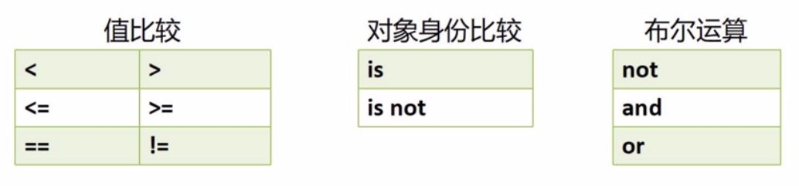
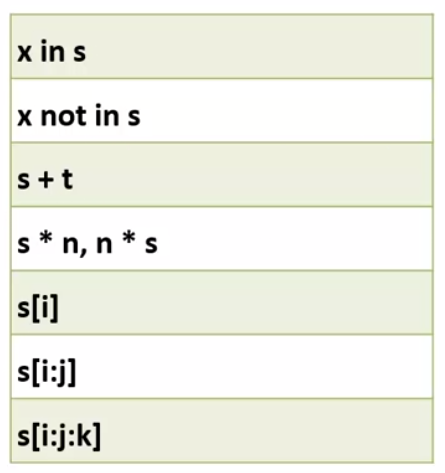
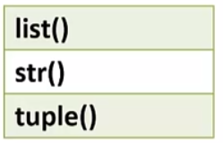
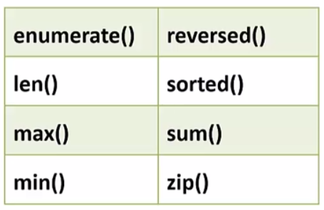

## 序列

#### 1  访问模式

- 元素从0开始通过下标偏移量访问；
- 一次可访问一个或多个元素；

------------------------------------------

#### 2  序列相关操作

​		**标准类型运算符：**值比较、对象身份比较、布尔运算；

​		

​		**序列类型运算符：**获取、重复、连接、判断；

​		*注意：week[::-1]是将序列逆序。*

​		

​		**内建函数：**序列类型转换内建函数，

​		

​		序列类型可用内建函数

​		

